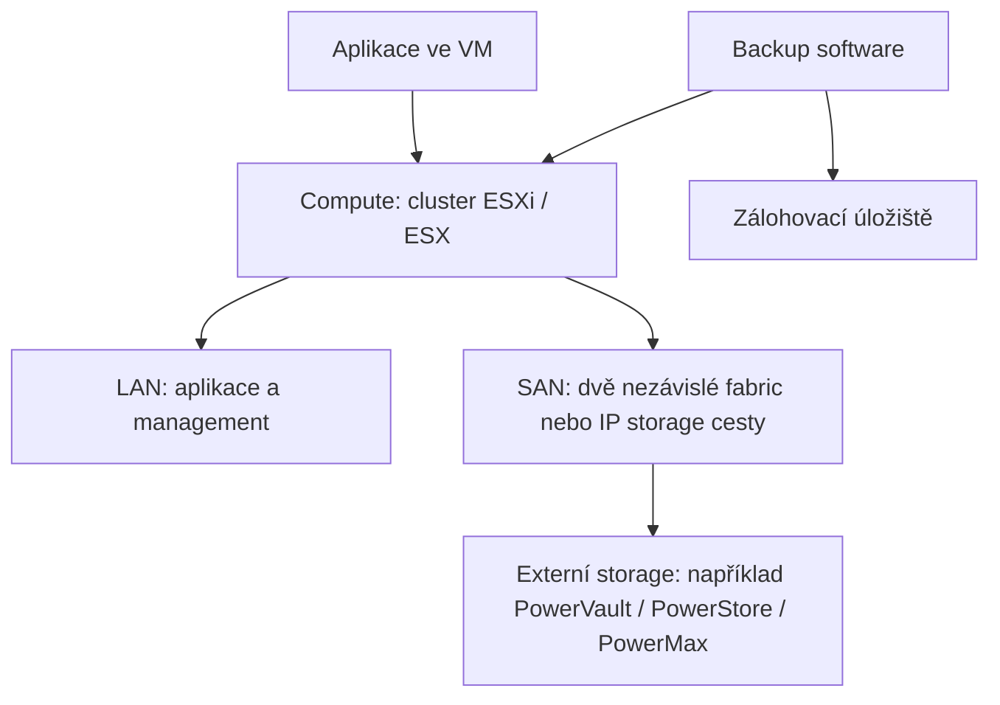
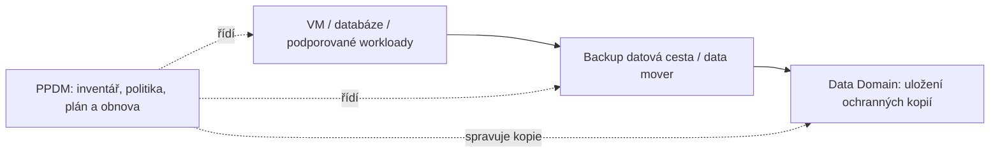

# VMware / Broadcom a Dell Technologies

<a id="kapitola-0"></a>

## 0. Účel, původ informací a pravidla čtení

Tento dokument spojuje dostupné poznámky z callu, technický výklad a praktický pohled Service Delivery Managera (SDM). Vysvětluje vztah mezi fyzickou infrastrukturou, virtualizací, privátním cloudem, storage a ochranou dat. Má sloužit jako dlouhodobě použitelný studijní základ, ze kterého lze následně vytvořit školení, zákaznické otázky, servisní katalog nebo podklady k projektu.

**Nejde o doslovný přepis callu ani o schválený zákaznický návrh.** V této úloze byl dostupný pouze vložený náhled konverzace a aktuální výčet požadovaných témat. Nástroj pro načtení celé původní konverzace nebyl dostupný a místní projekt neobsahoval další poznámky. Obrázky/slidy z původní konverzace nebyly dostupné. Dokument proto neslibuje zachování neviděných částí a nepřipisuje účastníkům nově vytvořené odborné závěry.

### 0.1 Označení původu

| Značka | Význam | Jak ji používat při dalším zpracování |
|---|---|---|
| **[CALL-P]** | Informace zachovaná v poskytnutém náhledu předchozí konverzace | Je to záznam z konverzace, často formulace předchozího asistenta, nikoli ověřená citace řečníka |
| **[CALL-Z]** | Informace o callu uvedená v aktuálním zadání uživatele | Zachovat; nepřidávat neznámou roli, termín či význam zkratky |
| **[TECH]** | Doplňující odborné vysvětlení | Není výrok z callu; produktová tvrzení doprovázejí oficiální zdroje |
| **[SDM]** | Doporučený provozní nebo delivery pohled | Autorská aplikace technických principů, nikoli závazný postup výrobce |
| **[PŘÍKLAD]** | Modelová situace, výpočet nebo architektura | Není popisem skutečného zákazníka |
| **[OVĚŘIT]** | Chybějící údaj nebo závislost na verzi, smlouvě či návrhu | Před realizací doplnit vlastníka, zdroj a rozhodnutí |

Označení u nadpisu platí pro celý oddíl, není-li uvnitř uvedena jiná značka. Technické kapitoly nejsou rekonstrukcí neviděného callu. Produktové názvy a možnosti jsou ověřovány k datu sestavení; verze uvedená na callu se tím zpětně nemění.

### 0.2 Co lze z dostupných podkladů zachovat

- **[CALL-P]** Byla probírána mapa Primary Storage: **PowerVault ME → PowerStore → PowerMax**, se zjednodušeným positioningem **entry / cost-efficient → universal enterprise → mission-critical**.
- **[CALL-P]** PowerVault byl vysvětlen jako dostupnější block storage; PowerStore jako univerzální enterprise block/file platforma; PowerMax jako high-end pro nejkritičtější provoz.
- **[CALL-P]** Padla témata SAN, block storage, scale-up a scale-out. V náhledu jsou také PowerScale, OneFS, Isilon a začátek vysvětlení ObjectScale.
- **[CALL-P]** Uživatel výslovně požadoval větší detail a následný co nejpodrobnější dokument pro další záměry.
- **[CALL-Z]** VMware/Broadcom část má pokrýt datacentra, x86, vSphere, SAN, vSAN/HCI, NSX/VCF Networking, vDefend, VCF 9 a externí služby.
- **[CALL-Z]** Zákaznické body: **ČSAS/Jakub** a **SPCSS: 17 MD, Cisco blade, VCF 9 nová farma, NGUP, plán zapojit Martina**.
- **[CALL-Z]** Dell část prezentoval **Lukáš**; požadovaný rozsah produktů je zachován v kapitolách 13–26.

### 0.3 Důležité opravy zjednodušení

**[TECH]** Zmínka „SMB prostředí“ u PowerVault v předchozím náhledu nesmí být zaměněna za podporu protokolu SMB: v tomto kontextu jde o *small and medium-sized businesses*, tedy malé a střední firmy. PowerVault ME poskytuje blokové úložiště; sdílené soubory SMB může nad jeho kapacitou poskytovat samostatný file server.

„Méně kritické → PowerVault, nejkritičtější → PowerMax“ je orientační mapa portfolia, nikoli technické pravidlo. Kritičnost služby musí být převedena na měřitelnou dostupnost, obnovu, výkon, podporu a odolnost celé architektury. Kritická aplikace může být provozována i na jiné řadě, pokud návrh splní její požadavky.

VCF neznamená automaticky VxRail a neznamená vždy vSAN jako jedinou možnou storage. PowerFlex není vSAN. Data Domain není totéž co backup software. HA, snapshot, replikace a záloha řeší odlišné situace.

## Obsah

1. [Datacentrum a kritická infrastruktura](#kapitola-1)
2. [3-tier architektura Compute / Storage / Network](#kapitola-2)
3. [x86, fyzický server a virtualizace](#kapitola-3)
4. [vSphere, ESXi/ESX a vCenter](#kapitola-4)
5. [VM, cluster, HA, DRS a vMotion](#kapitola-5)
6. [Storage: block, file, object a kapacita](#kapitola-6)
7. [SAN, FC, iSCSI, SAS a cesta I/O](#kapitola-7)
8. [vSAN a HCI](#kapitola-8)
9. [NSX / VCF Networking](#kapitola-9)
10. [vDefend a bezpečnost provozu](#kapitola-10)
11. [VMware Cloud Foundation a VCF 9](#kapitola-11)
12. [Zákaznické poznámky ČSAS a SPCSS](#kapitola-12)
13. [Mapa Dell portfolia](#kapitola-13)
14. [Primary Storage: jak číst positioning](#kapitola-14)
15. [PowerVault ME](#kapitola-15)
16. [PowerStore](#kapitola-16)
17. [PowerMax](#kapitola-17)
18. [PowerScale](#kapitola-18)
19. [ObjectScale](#kapitola-19)
20. [PowerFlex](#kapitola-20)
21. [VxRail](#kapitola-21)
22. [PowerProtect Data Domain](#kapitola-22)
23. [PowerProtect Data Manager](#kapitola-23)
24. [PowerProtect Cyber Recovery](#kapitola-24)
25. [VCF on VxRail](#kapitola-25)
26. [Dell Private Cloud](#kapitola-26)
27. [Architektonické scénáře a rozhodování](#kapitola-27)
28. [Provoz a řízení služby z pohledu SDM](#kapitola-28)
29. [Modelové incidenty a postup uvažování](#kapitola-29)
30. [Slovník pojmů, kontrolní otázky a otevřené body](#kapitola-30)
31. [Zdroje a evidence ověření](#kapitola-31)

<a id="kapitola-1"></a>

## 1. Datacentrum a kritická infrastruktura [TECH]

Datacentrum je propojený systém fyzických a logických služeb. Servery poskytují výpočetní prostředky, storage uchovává data a síť zajišťuje komunikaci. Aby aplikace fungovala, potřebuje zároveň napájení, chlazení, dostupné identity, překlad názvů, správný čas a provozní procesy.

Typický řetězec závislostí je:

```text
Obchodní služba: například zpracování zákaznického požadavku
  └─ Aplikace, databáze a integrace
      └─ Operační systémy / VM / kontejnery
          └─ Virtualizační nebo cloudová platforma
              ├─ Compute: CPU, RAM, případně GPU
              ├─ Storage: provozní data a jejich dostupnost
              └─ Network: komunikace a bezpečnostní hranice
                  └─ Fyzické prostředí: rack, energie, chlazení, kabeláž
```

Vedle něj existují průřezové závislosti: DNS, NTP, identity, certifikáty, správa klíčů, monitoring, zálohování a přístup administrátorů. Ty mohou způsobit rozsáhlý incident, i když každý server a každé diskové pole zůstává zapnuté.

### 1.1 Co znamená kritičnost

Technicky kritická služba má závažný dopad při nedostupnosti, chybě dat nebo narušení důvěrnosti. Kritičnost se netýká jen výkonu: pomalá aplikace může být obchodně nedostupná, nesprávně obnovená databáze může fungovat technicky a přesto obsahovat nepoužitelná data.

Právní zařazení subjektu nebo systému mezi kritickou infrastrukturu je samostatná otázka. Z tohoto dokumentu nelze vyvozovat konkrétní regulatorní status ČSAS ani SPCSS.

| Vlastnost | Otázka, kterou zodpovídá | Příklad požadavku, nikoli zákaznické SLA |
|---|---|---|
| Dostupnost | Jak dlouho může být služba nedostupná? | Definovaný časový rozpočet výpadků |
| Integrita | Jsou data správná a úplná? | Obnovené transakce jsou konzistentní |
| Důvěrnost | Kdo může data číst? | Oddělená oprávnění pro provoz a audit |
| RTO | Za jak dlouho má být služba obnovena? | Obnova do čtyř hodin |
| RPO | Jak stará mohou být obnovená data? | Nejvýše patnáct minut ztracených změn |
| Výkon | Jak rychle musí služba reagovat? | Limit odezvy při stanovené zátěži |
| Obnovitelnost | Umíme obnovu prokazatelně provést? | Úspěšný test celého procesu |

**RTO a RPO jsou cíle.** Teprve návrh a test prokážou, zda jich lze dosáhnout. Backup každých patnáct minut sám o sobě nedokazuje patnáctiminutové RPO, pokud zálohy selhávají, jsou nekonzistentní nebo nelze poslední kopii použít.

### 1.2 Redundance, fault domain a společná příčina výpadku

Redundance znamená existenci náhradní cesty nebo komponenty. Fault domain je oblast, která může selhat společně: disk, server, blade chassis, rack, síťová fabric, datacentrum nebo region.

Dva zdroje napájení zapojené do stejného vadného napájecího okruhu nejsou nezávislé. Dva hosty ve stejném chassis sdílejí jeho část infrastruktury. Dvě kopie dat spravované stejným kompromitovaným účtem nemusejí představovat nezávislou ochranu proti útoku.

**[SDM]** U každé deklarované redundance požadovat odpověď na tři otázky: proti jakému selhání chrání, co mají obě větve společné a kdy byl přechod na náhradní větev otestován.

### 1.3 Dostupnost jako vlastnost celé služby

**[PŘÍKLAD]** Při roce o 365 dnech odpovídá dostupnost 99,9 % přibližně 8 hodinám 46 minutám nedostupnosti; 99,99 % asi 52 minutám 34 sekundám. Smlouva ale může měřit jen provozní dobu a různě zacházet s plánovanou údržbou.

Marketingová dostupnost diskového pole není automaticky SLA aplikace. Aplikace může být nedostupná kvůli DNS, databázovému zámku, chybné změně firewallu nebo výpadku identity, přestože pole vykazuje plnou dostupnost.

<a id="kapitola-2"></a>

## 2. 3-tier architektura Compute / Storage / Network [TECH]

V této části znamená „3-tier“ rozdělení infrastruktury na **výpočetní, úložnou a síťovou vrstvu**. Nezaměňovat s aplikační třívrstvou architekturou web / aplikační server / databáze.

### 2.1 Compute

Compute zahrnuje fyzické servery a jejich CPU, RAM, případně akcelerátory. Servery mohou být rackové nebo blade. Mohou provozovat operační systém přímo na hardwaru (*bare metal*) nebo hypervisor, který rozděluje zdroje mezi virtuální stroje.

Blade je forma serveru zasunutého do společného chassis. Není to jiný princip virtualizace. Výhodou může být hustota a centralizovaná správa; návrh musí zohlednit sdílené napájení, interconnecty a omezení místních disků.

### 2.2 Storage

V klasické oddělené architektuře poskytuje úložiště samostatné pole. Servery se k němu připojují přes storage síť nebo přímo. Compute lze rozšiřovat nezávisle na kapacitě pole, ale je nutné hlídat výkon řadičů, portů, disků i fabric.

Oddělené pole neznamená jediný bod selhání za všech okolností: podniková pole mají redundantní komponenty. Celé pole však stále může tvořit společnou fault domain, například při chybě konfigurace nebo události zasahující celé datacentrum.

### 2.3 Network

Síť přenáší několik druhů provozu: aplikace, management, migrace VM, storage, zálohy a replikaci. Tyto provozy mohou používat různé fyzické sítě nebo sdílenou fyzickou síť s logickým oddělením a řízením kapacity.



Schéma je obecné: neukazuje přesné porty ani povinnou podobu konkrétního výrobku.

### 2.4 Výhody a nároky oddělených vrstev

Výhodou je nezávislé dimenzování, možnost využít stávající investice a jasné specializace týmů. Nárokem je koordinace kompatibility, patchování a incidentů napříč více komponentami.

**[SDM]** Při incidentu „VM je pomalá“ nepředpokládat automaticky problém VMware. Datová cesta zahrnuje aplikaci, guest OS, virtuální řadič, hypervisor, hostitelský adaptér, síť a storage. Vlastník služby musí spojit důkazy z více týmů do jedné časové osy.

<a id="kapitola-3"></a>

## 3. x86, fyzický server a virtualizace [TECH]

**x86** je rodina instrukčních architektur procesorů; v současném serverovém kontextu se zpravidla mluví o její 64bitové podobě x86-64. Není to značka serveru ani virtualizační produkt. Intel a AMD nabízejí procesory pro tuto architekturu; Dell nebo Cisco dodávají serverové systémy, které je mohou používat.

### 3.1 Socket, core, thread a vCPU

- **Socket:** fyzické místo pro procesor, případně osazený procesorový balíček.
- **Core:** fyzické výpočetní jádro uvnitř procesoru.
- **Thread / logical processor:** logický procesor poskytovaný například technologií SMT; dva thready nejsou dvě plnohodnotná samostatná jádra.
- **vCPU:** virtuální procesor přidělený VM; hypervisor plánuje jeho běh na fyzických prostředcích.

Součet vCPU může být větší než počet fyzických jader. To je CPU overcommit. Jeho bezpečná míra závisí na skutečné souběžné zátěži a citlivosti aplikací, nikoli na jednom univerzálním poměru.

Příliš velká VM může čekat na CPU i v prostředí, kde průměrné využití clusteru nepůsobí vysoké. Proto je důležitý *CPU Ready* — čas čekání na přidělení procesoru — a vhodná velikost VM.

### 3.2 RAM a NUMA

NUMA popisuje server, kde má procesor rychlejší přístup k části paměti než ke vzdálené paměti jiného procesoru. Velká VM přesahující vhodnou NUMA hranici může mít jiné výkonové chování než několik menších VM.

Nedostatek fyzické RAM může vést k mechanismům reclaimu a swapování. To může prudce zvýšit storage I/O a latenci aplikací. Pro SDM je důležité rozlišit „přidělenou RAM“, „aktivně používanou RAM“ a rezervu pro výpadek hostu.

### 3.3 Hardwarová kompatibilita

Shodný nápis x86 nezaručuje možnost libovolné živé migrace. CPU generace, instrukční sady, zařízení předaná přímo VM, firmware a verze hypervisoru mohou omezit mobilitu VM. EVC pomáhá sjednotit dostupné CPU funkce mezi kompatibilními hosty; není obecným mostem pro libovolnou kombinaci Intel a AMD. Omezení kompatibility CPU pro vMotion potvrzují [výkonová doporučení vSphere 9.0](https://www.vmware.com/docs/vsphere-esxi-vcenter-server-90-performance-best-practices).

**[SDM]** Při obnově serverů sledovat nejen záruku a kapacitu, ale také možnost koexistence starých a nových hostů během migrace, podporu ovladačů a budoucí podporované verze platformy.

<a id="kapitola-4"></a>

## 4. vSphere, ESXi/ESX a vCenter [TECH]

| Pojem | Praktický význam | Co si s ním neplést |
|---|---|---|
| VMware vSphere | Virtualizační platforma, jejímž základem jsou hypervisor a centrální správa | Není jeden fyzický server |
| ESXi / ESX | Hypervisor běžící přímo na serveru | Není vCenter ani guest OS |
| vCenter Server | Centrální správa hostů, clusterů, VM, oprávnění a operací | Nevykonává CPU instrukce všech VM |
| vSphere Client | Uživatelské rozhraní pro správu | Není vlastní hypervisor |
| VMware Tools | Komponenty uvnitř guest OS pro integraci s platformou | Nejsou kompletní aplikační monitoring |

V poznámkách je zachován běžný název **ESXi**. V dokumentaci generace 9 se setkáme také s názvem **ESX**; při správě konkrétního prostředí je rozhodující přesný produkt, verze a build, nikoli samotné historické pojmenování. Oficiální materiály VCF 9 popisují hosty ESX a jejich správu v clusterech pod vCenter. [Plánování nasazení VCF 9.0](https://blogs.vmware.com/cloud-foundation/2025/07/28/planning-a-successful-vmware-cloud-foundation-9-0-deployment/).

### 4.1 Co hypervisor dělá

Hypervisor poskytuje VM virtuální procesory, paměť, síťové adaptéry a disková zařízení. Rozhoduje, kdy dostane konkrétní VM fyzický CPU čas, zprostředkovává přístup k úložišti a odděluje jednotlivé virtuální stroje.

Na jednom fyzickém hostu může běžet více operačních systémů současně. Každá VM má vlastní guest OS a aplikace, ale sdílí fyzické prostředky. Izolace snižuje vzájemné ovlivnění; neodstraňuje závislost na společném hostu nebo úložišti.

### 4.2 Co vCenter dělá

vCenter sjednocuje inventář, oprávnění a řízení více hostů. Umožňuje definovat clustery, konfigurovat HA a DRS, organizovat migrace a integrovat zálohovací či automatizační nástroje.

Výpadek vCenter obvykle nezastaví již běžící VM. Zásadně však omezí centrální správu a navazující automatizaci. Předem nakonfigurované vSphere HA používá agenty na hostech a může restartovat VM i při nedostupnosti vCenter; obnova vCenter může být sama součástí tohoto procesu. HA je vymezené clusterem, nejde o automatický přesun do libovolného jiného clusteru. [Dostupnost vCenter Server](https://www.vmware.com/docs/availability-of-vcenter-server).

**[SDM]** Výpadek managementu má vlastní závažnost. I bez okamžitého dopadu na aplikace může zablokovat změny, přidělování zdrojů, obnovu nebo reakci na další poruchu.

### 4.3 VMware, Broadcom a Dell: vztah dodavatelů

Broadcom dokončil akvizici VMware dne 22. listopadu 2023. Proto se v aktuálních materiálech používá označení VMware by Broadcom. Jde o vlastnický a produktový kontext; technické pojmy vSphere, vCenter nebo vSAN je stále nutné rozlišovat podle jejich funkce. [Broadcom — dokončení akvizice VMware](https://www.broadcom.com/company/news/financial-releases/61541).

Dell je v tomto dokumentu dodavatelem hardwaru, storage, ochrany dat a integrovaných infrastrukturních řešení. Vazba Dell–VMware v konkrétním řešení neznamená, že se všechny licence a support automaticky nakupují či eskalují stejným způsobem.

**[SDM]** Vést zvlášť technickou kompatibilitu, licenční oprávnění a servisní odpovědnost. Funkční software může mít nevyřešené entitlement; platný support na serveru nemusí zahrnovat každý používaný software. Při incidentu rozhoduje skutečný kontrakt a dohodnutá eskalační cesta.

<a id="kapitola-5"></a>

## 5. VM, cluster, HA, DRS a vMotion [TECH]

### 5.1 Virtuální stroj a datastore

VM je logický počítač s konfigurací, virtuálními zařízeními, virtuálními disky a běhovým stavem v paměti. Virtuální disk se často označuje VMDK; jeho konkrétní uložení závisí na storage technologii.

Datastore je úložiště dostupné hypervisoru pro soubory nebo objekty VM. Může být tvořeno VMFS na blokovém zařízení, NFS exportem nebo vSAN. „VM má 500 GB disk“ neznamená automaticky, že právě teď fyzicky zabírá 500 GB; záleží na thin/thick provisioningu, skutečných zápisech a dalších kopiích.

### 5.2 Cluster

Cluster je skupina hostů, nad kterou se koordinují prostředky a vybrané služby. Samotné vložení hostů do clusteru ještě neprokazuje odolnost: musí existovat dostupná data, kompatibilní sítě, dostatečná rezerva a správné zásady.

**N+1** znamená dimenzování tak, aby provoz zvládl ztrátu jedné uvažované jednotky. Pro různě velké hosty je třeba počítat se ztrátou relevantního největšího hostu, ne mechanicky s průměrem. Rezervu může spotřebovat údržba.

### 5.3 HA — reakce na selhání

vSphere High Availability při určitých selháních restartuje postižené VM na dostupných hostech clusteru. Základní scénář je pád hostu, na kterém VM běžela. VM pak startuje z dostupného trvalého úložiště; její původní obsah RAM se tím běžně neobnovuje.

HA tedy obvykle zahrnuje přerušení služby: detekci poruchy, restart OS, recovery databáze a spuštění aplikace. Při správné konfiguraci může monitorovat i vybrané stavy VM; heartbeat VMware Tools však není důkazem funkčnosti obchodní transakce. [Broadcom: HA a monitorování VM](https://knowledge.broadcom.com/external/article/316525).

Admission control brání spotřebovat prostředky, které mají zůstat pro failover. Vypnutí této ochrany kvůli nedostatku kapacity může zlepšit okamžitou možnost zapnout další VM, ale oslabit schopnost přežít výpadek.

### 5.4 DRS — průběžné umísťování zátěže

Distributed Resource Scheduler vyhodnocuje potřeby VM a dostupné prostředky. Doporučuje nebo provádí jejich vhodné umístění a migrace podle nastavení automatizace a pravidel.

DRS není mechanismus obnovy paměti ze zhavarovaného hostu. Pomáhá předcházet nerovnoměrnému zatížení a usnadňuje údržbu. Automatické rozhodování může omezit nedostupnost managementu, nekompatibilita CPU, síť nebo pravidla affinity/anti-affinity. Podmínky fungování DRS a souvisejících clusterových služeb jsou závislé na verzi. [vSphere 9.0 Performance Best Practices](https://www.vmware.com/docs/vsphere-esxi-vcenter-server-90-performance-best-practices).

### 5.5 vMotion a Storage vMotion

**vMotion** přesouvá běžící VM mezi hosty. Přenáší stav paměti a běhu a provádí krátké závěrečné přepnutí. U klasického scénáře zůstávají disky na společném datastore. Podporované kombinované migrace mohou přesouvat i storage; konkrétní požadavky je nutné ověřit.

**Storage vMotion** přesouvá úložiště virtuálního stroje. Je užitečné při migraci mezi datastory, vyrovnávání kapacity nebo vyřazování starého pole. Není náhradou za zálohu: chybná data se přesunou spolu s dobrými.

Živá migrace potřebuje fungující zdrojový host. Po jeho náhlé ztrátě se u standardního HA provádí restart, nikoli dodatečný vMotion z vypnutého serveru.

| Situace | Typický mechanismus | Co zbývá ověřit |
|---|---|---|
| Plánovaný restart hostu | vMotion, maintenance mode, případně DRS | Zda cílové hosty unesou zátěž |
| Náhlý pád hostu | HA restart | Dostupnost storage a aplikace po startu |
| Nerovnoměrná zátěž | DRS | Zda skutečným limitem není storage nebo aplikace |
| Vyřazení datastore | Storage vMotion | Volné místo, kompatibilita a výkon migrace |
| Poškození nebo smazání dat | Obnova z vhodné kopie | Čistota, stáří a konzistence kopie |
| Ztráta lokality | Návrh DR nebo podporovaný metro/stretched scénář | Síť, kapacita, rozhodnutí o failoveru a návrat |

### 5.6 Provozní příklad [PŘÍKLAD]

Čtyři stejně velké hosty mají každý 100 jednotek použitelné kapacity. Aplikace potřebují 250 jednotek. Po ztrátě jednoho zůstává 300 jednotek: výpočetně může návrh vyhovět. Pokud je však jeden host již v údržbě a další selže, zbývá pouze 200. N+1 proto není automaticky odolnost proti selhání během každé údržby.

Reálný sizing musí tento princip provést samostatně pro CPU, RAM, storage výkon, kapacitu a síť. Nejmenší rezerva v jedné z těchto oblastí může určit limit celé služby.

<a id="kapitola-6"></a>

## 6. Storage: block, file, object a kapacita [TECH]

### 6.1 Block storage

Blokové úložiště poskytuje adresovatelný prostor bloků. Host jej vnímá jako diskové zařízení či volume. Nad ním může vytvořit filesystem, databázový prostor nebo VMFS datastore.

Storage nepracuje s obchodním významem souboru „smlouva.pdf“; z pohledu blokové vrstvy obsluhuje čtení a zápisy na adresy bloků. Správu souborů může provádět operační systém nebo hypervisor nad tímto zařízením.

**LUN** znamená Logical Unit Number; v provozní řeči se tím často myslí logické blokové zařízení prezentované hostům. Ne každý moderní protokol používá přesně stejnou terminologii — NVMe například pracuje s namespaces.

**Důležité:** připojení stejného běžného filesystemu pro zápis více nezávislým hostům může poškodit data, pokud filesystem nebo aplikace není na sdílený přístup navržena. VMFS je clusterový filesystem určený pro použití více ESXi hosty; obyčejné sdílení LUN samo o sobě tuto koordinaci nevytváří.

### 6.2 File storage

Souborové úložiště vystavuje soubory a adresáře. Klient přistupuje ke sdílení nebo exportu a storage/file server řeší namespace, oprávnění a souborové operace.

- **SMB** je běžný v prostředí Windows a při sdílení souborů pro uživatele.
- **NFS** je běžný v Unix/Linux prostředí a může sloužit i jako datastore VMware.
- **NAS** označuje síťové souborové úložiště; konkrétní implementace může být malý server nebo rozsáhlý scale-out cluster.

File storage často závisí na identitě: skupinách AD, mapování UID/GID, DNS a správných ACL. Problém „soubor nejde otevřít“ tak nemusí být nedostatek kapacity ani porucha disků.

### 6.3 Object storage

Objektové úložiště poskytuje objekty tvořené daty, klíčem a metadaty. Aplikace s nimi pracuje přes API, často S3. Objekty jsou organizovány v bucketech. Lomítka v názvu objektu mohou připomínat adresáře, ale neznamenají automaticky stejné chování jako v tradičním filesystemu.

Objektové úložiště se hodí pro aplikace napsané pro tento přístup, datová jezera, obsah, archivy a podporovaná zálohovací řešení. Není automatickou náhradou blokového disku pro libovolnou databázi ani přímou náhradou SMB share bez úprav aplikace nebo vhodné brány.

S3 kompatibilita neznamená identickou implementaci všech funkcí AWS S3. Ověřuje se konkrétní API, autentizace, verze objektů, Object Lock, lifecycle, velikosti objektů a chování použitého klienta.

| Vlastnost | Block | File | Object |
|---|---|---|---|
| Jednotka práce klienta | Blok / logické zařízení | Soubor a adresář | Objekt a klíč |
| Typický přístup | FC, iSCSI, SAS, NVMe-oF | NFS, SMB | S3 API přes HTTP(S) |
| Kdo spravuje souborovou strukturu | Host, hypervisor nebo aplikace | File server / NAS | Aplikace pracuje s objekty |
| Typický příklad | Datastore VM, databázový disk | Sdílení dokumentů, NFS datastore | Data lake, objektový archiv |
| Typický provozní problém | Latence, cesty, LUN mapping | Oprávnění, metadata, počet souborů | Klíče, policy bucketu, API, počet objektů |

### 6.4 Raw, usable, allocated a effective capacity

**Raw capacity** je součet fyzických kapacit médií. **Usable capacity** je využitelná kapacita po započtení ochrany dat a systémových potřeb. **Allocated/provisioned** je kapacita přidělená logicky. **Used/consumed** popisuje skutečné využití, ale je třeba určit, na které vrstvě se měří.

**Effective capacity** předpokládá určitý přínos komprese či deduplikace. Jde o jinou veličinu než fyzicky využitelná kapacita. PBe v katalogu nelze bez dalšího porovnávat s PB raw.

**[PŘÍKLAD]** Jestliže 100 TB logických dat fyzicky zabírá 40 TB, dosažený poměr redukce je 2,5:1. Není bezpečné podle tohoto poměru dimenzovat jiný dataset, například již komprimované video nebo šifrované zálohy.

**Thin provisioning** přiděluje prostor podle skutečných zápisů. Umožňuje logicky přislíbit více prostoru, než je právě fyzicky obsazeno. Neodstraňuje nutnost fyzickou kapacitu dodat dříve, než ji workload skutečně spotřebuje.

### 6.5 Výkon: IOPS, throughput a latency

- **IOPS:** počet I/O operací za sekundu; výsledek závisí na velikosti operací a jejich typu.
- **Throughput:** přenesená data za sekundu, například MB/s nebo GB/s.
- **Latency:** doba jedné operace, obvykle v ms nebo µs.
- **Queue depth:** počet rozpracovaných nebo čekajících požadavků.
- **Read/write ratio:** podíl čtení a zápisů.
- **Random/sequential:** náhodný nebo sekvenční přístup.

**[PŘÍKLAD]** 100 000 operací/s po 8 KiB odpovídá přibližně 781 MiB/s datového toku před další režií. Stejné IOPS při jiné velikosti bloku znamenají jinou propustnost. Výsledek není sizing konkrétního pole.

Průměrná latence může skrýt špičky. Pro citlivé aplikace dává smysl sledovat i percentily a odezvu aplikace. Výkon při běžném stavu je třeba oddělit od výkonu při rebuild, backupu, migraci a degradaci.

<a id="kapitola-7"></a>

## 7. SAN, FC, iSCSI, SAS a cesta I/O [TECH]

### 7.1 Co je SAN

Storage Area Network je síť zaměřená na přístup ke storage, typicky blokové. Není to jméno diskového pole. Výrok „máme SAN“ může v běžné řeči znamenat celou storage infrastrukturu; pro návrh je nutné rozlišit pole, přepínače, porty, adaptéry, protokol a konfiguraci hostů.

```text
Aplikace ve VM
 → guest filesystem / databázový engine
 → virtuální disk a virtuální řadič
 → ESXi / ESX storage stack
 → HBA nebo síťový adaptér hostu
 → FC fabric nebo Ethernet/IP síť
 → port storage řadiče
 → cache, ochrana dat a fyzická média
```

### 7.2 Fibre Channel

FC je technologie často používaná pro dedikovanou storage fabric. Host používá HBA a identifikátory WWPN; komunikaci v síti omezují zóny. Pole dále řídí, které zařízení uvidí který host — LUN masking/mapping.

Zoning a LUN masking řeší rozdílné vrstvy. Správná FC zóna ještě neznamená, že pole prezentuje správný volume. Správný mapping nepomůže, pokud k cílovému portu neexistuje funkční cesta.

### 7.3 iSCSI

iSCSI přenáší SCSI příkazy přes TCP/IP. Host je iniciátor, storage poskytuje target. Používá Ethernet, ale spolehlivost nelze odvozovat pouze ze jmenovité rychlosti portu. Důležité jsou konfigurace cest, ztrátovost, zahlcení, MTU a segmentace.

IP storage může být dedikovaná nebo sdílená. Pokud sdílí fyzické linky s backupem či migracemi, musí návrh zajistit dostatečnou kapacitu a řízení provozu. Autentizace typu CHAP není sama o sobě šifrování datové komunikace.

### 7.4 SAS

Serial Attached SCSI se používá k připojení disků a také v některých přímých propojeních server–pole. Z pohledu host connectivity jde typicky o **DAS — direct-attached storage**, nikoli běžnou rozsáhlou FC/IP fabric.

U konkrétního pole může SAS označovat hostitelský port, spojení do rozšiřující police nebo diskové rozhraní. Tyto tři věci nelze zaměňovat. Pole se SAS backendem může mít směrem k hostům FC nebo iSCSI.

### 7.5 NVMe a NVMe over Fabrics

NVMe je protokol navržený pro moderní nevolatilní paměti. NVMe disky uvnitř pole neznamenají automaticky, že se host připojuje přes NVMe. Frontend může stále používat klasické SCSI přes FC nebo iSCSI.

NVMe/FC a NVMe/TCP přenášejí NVMe příkazy přes síť. Celá cesta musí být podporovaná: host, ovladač, firmware, síť, target a konfigurace multipathingu. Samotná změna protokolu nezaručuje zrychlení aplikace, pokud ji omezuje něco jiného.

### 7.6 Multipathing a dvě fabric

Multipathing umožňuje hostu používat více cest k jednomu logickému zařízení. Zvyšuje odolnost a podle implementace také rozkládá provoz. Správný počet cest není totéž co jejich skutečná nezávislost.

**[PŘÍKLAD]** Host má HBA A do fabric A a HBA B do fabric B. Každá fabric vede k dostupným portům pole. Výpadek jedné větve má být zvládnut druhou; musí to potvrdit podporovaná politika hostu a test. Dvě linky přes jeden společný přepínač nechrání proti výpadku tohoto přepínače.

**[SDM]** Při převzetí SAN chtít schéma obou větví, seznam WWPN/IQN a mapování, podporované verze, výsledky testu ztráty cesty a vlastníky odpovědné za host, fabric a pole.

<a id="kapitola-8"></a>

## 8. vSAN a HCI [TECH]

### 8.1 Princip vSAN

VMware vSAN vytváří distribuované úložiště z lokálních médií hostů a zpřístupňuje je v rámci virtualizační platformy. Data a jejich ochrana jsou rozmístěny podle storage policies. Storage síť mezi hosty je zásadní součástí datové cesty.

HCI — Hyperconverged Infrastructure — spojuje compute a software-defined storage do společných uzlů. U klasické vSAN HCI architektury host provozuje VM a zároveň přispívá disky do společného úložiště. Přidání uzlu může rozšířit současně CPU, RAM, kapacitu a storage výkon, ovšem v poměru daném konfigurací uzlu.

HCI neodstraňuje síť ani zálohování. Přesouvá část storage funkcí ze samostatného pole do softwaru běžícího na serverech.

### 8.2 OSA a ESA

vSAN Original Storage Architecture (OSA) používá diskové skupiny s cache a capacity zařízeními. Express Storage Architecture (ESA) je novější architektura orientovaná na kvalifikovaná NVMe zařízení a jinou organizaci datové cesty; nepotřebuje oddělený cache disk v podobě známé z OSA. Nelze předpokládat, že libovolný server s NVMe disky je pro ESA podporovaný. [Oficiální vSAN FAQ](https://www.vmware.com/docs/vmw-vsan-faqs).

Pro nový návrh výrobce preferuje ESA; současně je nutné ověřit kvalifikaci hardwaru, ovladače, firmware a velikost clusteru. Upgrade verze existujícího OSA clusteru není automaticky změna architektury na ESA. [vSAN Design Guide](https://www.vmware.com/docs/vmware-vsan-design-guide).

### 8.3 Storage policies a odolnost

Storage policy stanovuje požadavky na ochranu a další vlastnosti objektů VM. **FTT — failures to tolerate** vyjadřuje požadovanou toleranci poruch v příslušném modelu. Replikované kopie a erasure coding mají odlišnou kapacitní režii a požadavky na rozmístění.

Nelze přenášet minimální počty hostů nebo kapacitní poměry mezi OSA, ESA, verzemi a stretched konfiguracemi bez ověření. Důležité je, zda policy lze nejen přiřadit, ale také skutečně splnit — stav compliance.

**Resync/rebuild** po poruše obnovuje požadovanou ochranu. Spotřebovává síť, disky a volnou kapacitu. Cluster, který právě přežil jednu poruchu, může být do dokončení opravy vystaven vyššímu riziku další poruchy.

### 8.4 Witness a stretched cluster

Witness poskytuje rozhodovací metadata pro vybrané topologie; není automaticky plnou další kopií provozních dat. Ve stretched návrhu se řeší umístění dat mezi lokalitami, quorum, dostupnost witness a chování při přerušení mezilokalitní komunikace.

Tři adresy lokalit samy o sobě nedokazují tři nezávislé fault domains. Síťové trasy, identita, elektřina i management mohou mít společný bod selhání.

### 8.5 vSAN nemusí vždy znamenat pevně spojené škálování

Vedle klasické HCI existují podporované disaggregované modely vSAN, které umožňují oddělit storage a compute clustery. Konkrétní produktové označení, topologie a dostupné workflow jsou závislé na verzi. Základní pojem HCI je proto vhodné používat pro architektonický model, nikoli jako automatický popis každého nasazení vSAN. [vSAN FAQ](https://www.vmware.com/docs/vmw-vsan-faqs).

### 8.6 Co sledovat jako SDM [SDM]

Sledovat stav policies, health, volnou kapacitu po započtení rezerv, resync backlog, síťové chyby a dobu oprav. Před údržbou uzlu zkontrolovat, zda cluster není již degradovaný a jaký režim přesunu dat maintenance mode použije. „VM jsou zapnuté“ neznamená „cluster má plnou redundanci“.

Pro rozšíření chtít capacity plán zahrnující odolnost i údržbu. Pro smluvní dostupnost chtít otestovanou obnovu aplikace, nejen zelený vSAN dashboard.

<a id="kapitola-9"></a>

## 9. NSX / VCF Networking [TECH]

### 9.1 Softwarově definovaná síť

NSX poskytuje síťové funkce v softwarové vrstvě. Logická síť může být vytvářena a spravována jako součást cloudové platformy, aniž by každá změna znamenala ruční konfiguraci celé fyzické sítě.

**Underlay** je fyzická síť, která přenáší provoz. **Overlay** je logická síť vybudovaná nad ní. Overlay závisí na správné underlay konektivitě, MTU a dostupnosti transportních endpointů. Virtualizace sítě nezruší chybnou kabeláž ani nedostatečnou propustnost.

### 9.2 East–west a north–south

- **East–west:** komunikace mezi workloady uvnitř prostředí, například aplikace–databáze.
- **North–south:** komunikace mezi prostředím a vnějším světem, například uživatel–aplikace nebo datacentrum–internet.

Distribuované funkce mohou zpracovávat část komunikace přímo u hostů. Některé centralizované a hraniční služby používají specializované komponenty. Umístění NSX Edge a routing je věcí konkrétního návrhu, nikoli univerzálního obrázku platného pro všechny verze.

### 9.3 VCF 9, VPC a Transit Gateway

VCF 9.0 posiluje model **Virtual Private Cloud (VPC)**: oddělený logický prostor sítě pro tým, projekt nebo tenanta. Součástí síťového modelu je Transit Gateway pro propojení VPC a dalších sítí. Nové varianty konektivity zahrnují i distribuované napojení na fabric; potřeba Edge závisí na požadovaných službách. [Oficiální popis VCF 9.0 Networking](https://blogs.vmware.com/cloud-foundation/2025/06/17/modernize-networking-in-vcf-9-0/).

Oficiální FAQ pro VCF 9.0 uvádí, že NSX je požadovanou instalovanou komponentou, ale zákazník nemusí aktivně používat overlay a logické směrování; může pokračovat s VLAN-backed port groups. **„Máme VCF“ tedy není důkaz, že veškerý provoz používá overlay.** [VCF 9.0 FAQ](https://www.vmware.com/docs/vmware-cloud-foundation-9-0-general-faqs).

### 9.4 Provozní dopady [SDM]

Je třeba určit hranici odpovědnosti mezi fyzickou sítí, virtualizačním týmem a security. Změna může projít v logické konfiguraci, ale selhat kvůli chybějící underlay trase nebo pravidlu fyzického firewallu.

Při předání služby požadovat IP plán, VLAN/VPC schéma, routing, pravidla přístupu, DNS/NTP závislosti, MTU, kapacitní předpoklady a postup sběru diagnostiky. Zvlášť evidovat, která část konektivity je centrální a která distribuovaná.

<a id="kapitola-10"></a>

## 10. vDefend a bezpečnost provozu [TECH]

vDefend je portfolio bezpečnostních funkcí zaměřených mimo jiné na ochranu laterální komunikace a mikrosegmentaci. Distributed Firewall umožňuje aplikovat pravidla blízko workloadů. Pokročilá detekce a prevence hrozeb závisejí na konkrétní nabídce a licenčním oprávnění. Nelze je automaticky připsat každé instalaci NSX nebo základnímu VCF. [VMware vDefend](https://www.vmware.com/products/security/vdefend-distributed-firewall), [integrace s VCF 9.0](https://blogs.vmware.com/security/2025/06/announcing-vdefend-for-vcf-9).

### 10.1 Mikrosegmentace na příkladu

**[PŘÍKLAD]** Webová část smí komunikovat s aplikační částí na konkrétním portu. Aplikační část smí přistupovat k databázi. Webový server nemá mít obecný administrátorský přístup ke všem ostatním VM. Mikrosegmentace omezuje možnosti útočníka, který již ovládl jeden workload.

Pravidla mohou používat logické skupiny a značky, pokud to návrh podporuje. To umožní odvozovat oprávnění od role workloadu namísto ručně udržovaného seznamu každé adresy. Chybný tag však může mít bezpečnostní dopad stejně jako chybné pravidlo.

### 10.2 Proč firewall není celá bezpečnost

Firewall řídí povolenou komunikaci. Nenahrazuje opravy OS, správu privilegovaných účtů, ochranu endpointů, zabezpečení záloh ani reakci na incident. Povolenou aplikační cestou může proběhnout škodlivý požadavek; ochrana potřebuje více vrstev.

Zero Trust je princip ověřování a minimálních oprávnění, nikoli stav dosažený nákupem jediného produktu. Oddělení managementu je důležité, protože kompromitace řídicí vrstvy může ovlivnit mnoho workloadů současně.

### 10.3 Zavedení a provoz pravidel [SDM]

Nejdříve zjistit skutečné komunikační závislosti, určit vlastníky aplikací a vytvořit návrh pravidel. Ověřit běžný provoz, dávky, backup, monitoring, aktualizace a DR. Teprve poté řízeně zpřísňovat politiku a vyhodnocovat zamítnuté komunikace.

Úspěšné nasazení má obsahovat vlastníka každé výjimky, důvod, dobu platnosti a postup odstranění. Bez této disciplíny se z mikrosegmentace stane obtížně spravovatelná sada trvalých výjimek.

<a id="kapitola-11"></a>

## 11. VMware Cloud Foundation a VCF 9 [TECH]

### 11.1 Co VCF představuje

VMware Cloud Foundation je integrovaná platforma privátního cloudu. Spojuje virtualizaci, storage, síť a jejich řízení s provozními a automatizačními funkcemi. VCF je širší než samotné vSphere: cílem je standardizovaná platforma a způsob jejího provozu a poskytování.

Oficiální portfolio uvádí vSphere, vSAN, NSX, VCF Operations, VCF Automation a další komponenty či služby. Dostupnost rozšíření není totožná s jejich zahrnutím v základní licenci. [VMware Cloud Foundation](https://www.vmware.com/products/cloud-infrastructure/vmware-cloud-foundation).

### 11.2 Management domain a workload domains

**Management domain** hostuje řídicí komponenty dané VCF instance. **VI workload domain** je logická a provozní hranice pro další workloady; obsahuje jeden nebo více clusterů a vlastní vCenter. Není to Active Directory doména.

Pro generaci VCF 9 je užitečné rozlišovat **cluster → workload domain → VCF instance → fleet → private cloud**. Instance má management domain; fleet může zahrnovat více instancí se společnými fleet management komponentami. Ty zahrnují VCF Operations a VCF Automation. [Architektura VCF 9.0](https://blogs.vmware.com/cloud-foundation/2025/07/28/planning-a-successful-vmware-cloud-foundation-9-0-deployment/).

```text
VCF private cloud — logický rámec poskytování služby
└─ Fleet — společný provozní rámec
   ├─ VCF Operations / VCF Automation
   └─ VCF instance
      ├─ Management domain
      │  └─ Management cluster(y), řídicí VM
      ├─ Workload domain A
      │  └─ vCenter A, cluster(y) pro vybraný provoz
      └─ Workload domain B
         └─ vCenter B, cluster(y) pro další provoz
```

Schéma vysvětluje vztahy, nikoli povinné fyzické umístění každé appliance. Oddělení domén nemusí samo o sobě znamenat nezávislost identity, storage, fyzické sítě či lokality.

### 11.3 Proč domény oddělovat

Oddělení může pomoci kvůli různým lifecycle oknům, kapacitním potřebám, administrativním hranicím či požadavkům na izolaci. Není účelné vytvářet doménu pro každou aplikaci bez zvážení režie.

Sdílená platforma šetří prostředky, ale rozšiřuje dopad společné chyby. Vyhrazená platforma usnadní některé hranice, ale zvýší náklady a počet komponent k údržbě. Rozhodnutí má vycházet z rizika, velikosti prostředí a provozních schopností.

### 11.4 VCF 9 není jedno neměnné vydání

**[CALL-Z]** U SPCSS je zachován bod „VCF 9 nová farma“. Není znám přesný minor release, build ani definitivní topologie.

**[TECH]** K datu sestavení existují veřejné materiály pro VCF 9.1. Tato skutečnost zpětně neznamená, že se na callu mluvilo o 9.1. V dokumentaci a plánu implementace je nutné uvést přesnou cílovou verzi a podporovanou cestu, nikoli jen „devítka“. [VCF 9.1 FAQ](https://www.vmware.com/docs/vmware-cloud-foundation-9-1-general-faqs).

VCF 9 rozvíjí sjednocenou instalaci, fleet operations, automatizaci a VPC. SDDC Manager je součástí architektury VCF 9.0; nelze jednoduše prohlásit, že se starší management komponenta beze zbytku přejmenovala na Operations. Rozdělení workflow se musí číst pro příslušné vydání.

### 11.5 Greenfield, brownfield, import a convergence

- **Greenfield:** budování nového prostředí podle cílového návrhu.
- **Brownfield:** využití již existující infrastruktury.
- **Import/convergence:** podporované postupy začlenění existujícího prostředí do VCF; přesný význam a podmínky určuje dokumentace konkrétního workflow.
- **Migrace workloadů:** přesun aplikací/VM do cílové platformy; není totožný s importem jejího managementu.

**[SDM]** Nová farma může znamenat greenfield infrastrukturu, ale projekt stále potřebuje brownfield analýzu zdrojových aplikací, konektivity a záloh. Instalace prázdného clusteru není dokončení migrace služby.

### 11.6 Storage ve VCF

VCF 9 podporuje více storage modelů. Oficiální materiál z listopadu 2025 popisuje možnost použít NFSv3 nebo FC/VMFS jako principal storage management domain při greenfield nasazení a další varianty prostřednictvím importu/convergence. To neznamená, že každý protokol podporovaný ESXi je automaticky dostupný v každém instalačním workflow. [VCF 9 a externí storage](https://blogs.vmware.com/cloud-foundation/2025/11/11/vmware-cloud-foundation-9-now-ready-for-all-storage/).

**Principal storage** je hlavní storage daného clusteru ve smyslu VCF workflow. **Supplemental storage** je dodatečně připojené úložiště. Konkrétní podpůrná pravidla a možnosti změny principal storage je nutné ověřit před návrhem migrace.

**[SDM]** Kompatibilita má několik úrovní: pole ↔ ESX; protokol ↔ verze; VCF workflow ↔ typ domény; a případně ještě Dell validované řešení. Jeden zelený řádek v obecné matici neprokazuje všechny ostatní.

### 11.7 Externí služby Backup / Identity / Monitoring

„Externí“ zde znamená samostatnou funkční a odpovědnostní oblast vůči základnímu workload stacku. Nemusí jít o fyzický server mimo datacentrum. Část těchto funkcí může být integrována ve VCF, ale celá podniková služba obvykle obsahuje další systémy.

| Oblast | Proč ji platforma potřebuje | Co má být samostatně navrženo |
|---|---|---|
| Backup | Obnova managementu, VM a aplikačních dat | Kopie, konzistence, retence, target, přístupy, testy |
| Identity | Ověření administrátorů, uživatelů a služeb | IdP/AD vazby, RBAC, MFA, nouzový přístup |
| Monitoring | Stav platformy, kapacita a incidenty | Integrace do podnikového dohledu, vlastníci alarmů, syntetické testy |
| DNS/NTP | Překlad názvů a správný čas | Redundance, dosažitelnost při bootstrapu a DR |
| PKI / klíče | Důvěra mezi službami a šifrování | Certifikáty, expirace, KMS, obnova klíčů |
| ITSM / CMDB | Řízení změn a evidence závislostí | Vazba CI–služba, aktualizace inventáře |

**[PŘÍKLAD]** Pokud identity, DNS, backup katalog i jejich jediné zálohy závisí na stejném nedostupném clusteru, vzniká kruhová závislost obnovy. Návrh musí určit, jak se zprovozní první komponenty a jak se administrátor přihlásí bez běžného IdP.

### 11.8 Licence, podpora a lifecycle [SDM]

Technický název produktu není důkaz zakoupeného oprávnění. V evidenci držet kontrakt, SKU, metriku licence, rozsah kapacity, termín platnosti, entitlement, support a zvlášť doplňky jako vDefend či další služby. Ceny a podmínky nelze dovozovat ze starých screenshotů nebo názvů edic.

Patch plán musí koordinovat hypervisor, vCenter, síťovou vrstvu, storage, management a OEM firmware. Nejnovější samostatně dostupná verze jedné komponenty nemusí být správným cílem pro integrovaný stack. Rozhodující je podporovaná kombinace a cesta upgradu.

<a id="kapitola-12"></a>

## 12. Zákaznické poznámky ČSAS a SPCSS

### 12.1 ČSAS / Jakub [CALL-Z]

V aktuálním zadání je explicitně uvedena vazba **„ČSAS/Jakub“**. Dostupné podklady neobsahují Jakubovu funkci, příjmení, konkrétní požadavek, rozhodnutí ani další kroky.

**[OVĚŘIT]** Doplnit, zda Jakub vystupuje jako zákaznický kontakt, technický garant, obchodní kontakt nebo člen delivery. Bez toho nelze přiřadit vlastnictví úkolu ani eskalaci.

**[SDM]** Pro navazující zpracování založit stručnou kartu: zákazník, služba/projekt, aktuální problém nebo záměr, kontakty a role, dohodnutý výstup, vlastník dalšího kroku, termín a vazba na technickou architekturu. Žádný z těchto chybějících údajů se v tomto dokumentu nepovažuje za již dohodnutý.

### 12.2 SPCSS — zachované body [CALL-Z]

| ID | Bod ze zadání | Co je skutečně známé | Co z něj nelze automaticky odvodit |
|---|---|---|---|
| SPCSS-01 | **17 MD** | Byla uvedena hodnota a zkratka | Zda jde o odhad, rozpočet, objednávku, vykázání nebo zbývající práci |
| SPCSS-02 | **Cisco blade** | Zmíněna serverová forma a dodavatel | Přesný UCS model, generace, CPU, počet serverů, konfigurace ani podpora VCF |
| SPCSS-03 | **VCF 9 nová farma** | Záměr nové farmy spojené s VCF 9 | Přesné vydání, design domén, storage, migrace, licence nebo stav schválení |
| SPCSS-04 | **NGUP** | Zkratka je součástí kontextu | Její plné znění, hranice projektu, vazby a milníky |
| SPCSS-05 | **Plán zapojit Martina** | Existuje plán zapojení | Martinova role, dostupnost, rozsah odpovědnosti a závazný termín |

Tato tabulka zachovává poznámky; nedoplňuje zákaznická fakta z domněnek ani z veřejného webu.

### 12.3 Interpretace 17 MD — pouze pracovní hypotéza [SDM]

V delivery kontextu MD často znamená *man-day*, člověkoden. **Není doloženo, že právě tento význam platí zde.** Pokud ano, jde o pracnost, nikoli přímo kalendářní délku.

**[PŘÍKLAD]** Při konvenci 8 hodin/MD by 17 MD představovalo 136 člověkohodin. Dva lidé nemusí úkol dokončit přesně za 8,5 dne: práce může mít sekvenční závislosti, čekání na přístupy nebo pevná změnová okna. Konvence hodin i význam 17 MD musí být potvrzeny.

Pro odhad je nutné rozlišit návrh, přípravu, implementaci, migraci, testy, dokumentaci, předání a projektovou koordinaci. Bez rozsahu a předpokladů není číslo dostatečným podkladem pro závazek.

### 12.4 Cisco blade a nová VCF farma [SDM]

První technický krok je inventura existujícího hardwaru a podpory. Zjistit přesné modely blade serverů, chassis, CPU, RAM, adaptéry, firmware, boot zařízení a síťové propojení. Pokud jde o Cisco UCS, doplnit konkrétní management a fabric infrastrukturu; nelze ji z pouhého slova blade považovat za známou.

Dále ověřit, zda plán předpokládá vSAN nebo externí storage. Blade provedení může mít omezené možnosti lokálních disků; to je důvod pro ověření, nikoli automatický zákaz vSAN. Rozhoduje validovaná konfigurace a požadovaný návrh.

Pro „novou farmu“ určit alespoň:

1. Zdrojové a cílové prostředí, počet lokalit a hranice služby.
2. Přesné cílové vydání VCF a kompatibilitu serverů, storage a sítí.
3. Management domain, workload domains a kapacitu managementu.
4. IP plán, DNS, NTP, identity, certifikáty a administrátorský přístup.
5. Principal storage a způsob jejího zprovoznění podporovaným workflow.
6. Zálohování managementu a aplikací, monitoring a obnovu.
7. Migrační vlny, pilot, testy, rollback a akceptaci.
8. Licenční a support oprávnění a odpovědnosti dodavatelů.

### 12.5 NGUP a zapojení Martina [SDM]

NGUP ponechat beze změny jako interní zkratku, dokud její vlastník nepotvrdí plný název a rozsah. Neodvozovat z ní technologii ani smluvní závazek.

Martinovo zapojení konkretizovat přes požadovaný výstup: například revize architektury, implementace, technický workshop nebo podpora migrace. Jde o možné role, nikoli tvrzení, že některá byla dohodnuta. Před přidělením práce potvrdit kapacitu a rozhodovací pravomoc.

### 12.6 Navržený registr dalších kroků [SDM]

| ID | Navržený krok | Výstup | Vlastník / termín |
|---|---|---|---|
| C-01 | Upřesnit vazbu ČSAS–Jakub | Karta kontaktu a tématu | K doplnění |
| S-01 | Potvrdit význam a rozsah 17 MD | Odhad s předpoklady a výlukami | K doplnění |
| S-02 | Získat inventář Cisco blade | HW/SW baseline a kompatibilita | K doplnění |
| S-03 | Potvrdit cílovou verzi a topologii VCF | Schválený high-level design | K doplnění |
| S-04 | Rozšifrovat NGUP | Rozsah, závislosti, milníky | K doplnění |
| S-05 | Upřesnit zapojení Martina | Role, výstup, kapacitní rezervace | K doplnění |

<a id="kompetencni-profil-lukas-travnicek"></a>

## 12A. Interní kompetenční profil — Lukáš Trávníček

> **[INTERNÍ PROFIL, zaznamenáno 22. 9. 2026]** Tato kapitola zachycuje sebehodnocení specialisty, které uživatel dodal do KB. Není to produktová specifikace, personální závazek, potvrzení dostupnosti ani popis smluvní odpovědnosti. Uvedení certifikace neobsahuje její přesný název, úroveň, datum ani platnost; tyto údaje je před použitím v nabídce nebo projektu nutné ověřit.

### Dell Technologies: zkušenost, certifikace a aktuální zaměření

| Oblast | Produkt | Praktická zkušenost | Certifikace podle profilu | Aktuální kontext |
|---|---|---|---|---|
| Entry SAN | PowerVault | Malá; orientace podle dokumentace | Neuvedena | Vhodný pro konzultaci a dohledání podkladů, ne automaticky jako jediný realizační vlastník |
| Univerzální storage | PowerStore | Praktická zkušenost | Uvedena | Aktivní kompetence |
| Tier-0 storage | PowerMax | Historická zkušenost | Uvedena | Je nutné ověřit aktuálnost vůči verzi a projektovému scénáři |
| NAS | PowerScale | Menší zkušenost | Uvedena | Dílčí praktická kompetence |
| Object Storage / S3 | ObjectScale | Velká zkušenost | Uvedena | Silná produktová kompetence |
| Software Defined Storage | PowerFlex | Bez praktické zkušenosti | Uvedena | Pro realizaci doplnit zkušeného specialistu |
| Backup Storage | PowerProtect Data Domain | Zkušenost z období EMC i Dell | Neuvedena | Lukáš se oblasti aktuálně nevěnuje |
| Backup Software | PowerProtect Data Manager | Bez praktické zkušenosti | Neuvedena | Lukáš se oblasti aktuálně nevěnuje |
| Cyber Vault | PowerProtect Cyber Recovery | Bez praktické zkušenosti | Neuvedena | Lukáš se oblasti aktuálně nevěnuje |
| HCI | VxRail | Největší zkušenost | Uvedena | Jedna z nejsilnějších praktických kompetencí |
| Private Cloud | VCF on VxRail | Největší zkušenost | VxRail / VMware uvedena | Jedna z nejsilnějších praktických kompetencí |
| Cloud Platform | Dell Private Cloud (DAP) | Bez praktické zkušenosti | Uvedena | Očekávaná budoucí oblast rozvoje |

### VMware / Broadcom: hloubka podle komponent

- **Celý VCF stack a add-ony:** obecná znalost a schopnost zasadit komponenty do celku.
- **vSphere a vSAN:** hlubší znalost core produktů.
- **NSX:** základní znalost; hlubší návrh a realizace vyžadují odpovídající síťovou expertizu.
- **HCX:** základní znalost se zaměřením na migrace.
- **VMware Operations:** základní znalost, zatím s menší hands-on zkušeností.
- **VKS (VMware Kubernetes Service):** právě studovaná a rozvíjená oblast.
- **Automation:** nejslabší oblast; pre-sales orientace bez hands-on zkušenosti.
- **vDefend, data services a cyber recovery add-ony:** bez reálné praktické zkušenosti.

Lukáš současně uvedl, že si dokáže potřebné informace dohledat v dokumentaci a pochopit jejich princip. Pro SDM je tato schopnost cenná při přípravě workshopu, triage a koordinaci specialistů. Nesmí se ale zaměnit s oprávněním provést změnu, s produkční zkušeností ani s formálně přiřazenou odpovědností.

### Jak profil používat při sestavení týmu [SDM]

Profil pracuje se třemi nezávislými osami: **praktická zkušenost**, **certifikace** a **aktuální zaměření**. Certifikovaný člověk může mít malou praktickou zkušenost; zkušený člověk se dané oblasti nemusí aktuálně věnovat. Před zahájením projektu proto SDM nebo PM potvrzuje konkrétní roli, časovou dostupnost, zkušenost s požadovanou verzí, hranici odpovědnosti a jméno dalšího specialisty pro nepokryté části.

Pro VxRail, VCF on VxRail a ObjectScale lze podle profilu očekávat nejsilnější praktický sparring. PowerStore, historická zkušenost s PowerMax a menší zkušenost s PowerScale vyžadují ověření proti konkrétnímu rozsahu. U PowerFlex, Dell Private Cloud, PPDM, Cyber Recovery a VMware Automation musí projekt počítat s dalším hands-on specialistou. U Data Domain existuje historická zkušenost, ale oblast není součástí Lukášova aktuálního zaměření.

<a id="kapitola-13"></a>

## 13. Mapa Dell portfolia

**[CALL-Z]** Dell část je spojena s Lukášem. Následující mapa pokrývá produkty požadované uživatelem; není přesnou reprodukcí nedostupného slidu ani úplným katalogem Dell Technologies.

**[TECH]** Portfolio je vhodné číst podle funkce v architektuře:

| Oblast | Produkty / pojmy | Základní role |
|---|---|---|
| Compute | PowerEdge | Fyzické servery a základ pro další systémy |
| Primary Storage | PowerVault ME, PowerStore, PowerMax | Provozní data aplikací, VM a databází |
| Unstructured Data Storage | PowerScale, ObjectScale | Rozsáhlá souborová a objektová data |
| Software-defined storage | PowerFlex | Distribuovaná storage s pružným oddělením nebo spojením compute a storage |
| HCI | VxRail | Integrovaný systém pro VMware infrastrukturu |
| Protection storage | PowerProtect Data Domain | Úložiště záloh s datovou redukcí a ochrannými funkcemi |
| Backup software | PowerProtect Data Manager (PPDM) | Řízení ochrany workloadů, politik a obnovy |
| Cyber recovery | PowerProtect Cyber Recovery | Izolované kopie a proces obnovy po kybernetické události |
| Integrovaný privátní cloud | VCF on VxRail | VCF na validovaném VxRail řešení |
| Automatizovaná modulární infrastruktura | Dell Private Cloud | Nasazení a správa podporovaných cloudových stacků přes Dell Automation Platform |

Kategorie se mohou překrývat. PowerScale může nabízet S3 přístup; tím se nestává totožným produktem s ObjectScale. PowerFlex může být provozován hyperkonvergovaně; tím se nestává VxRail. PowerStore může hostit kritickou databázi; tím se nestává PowerMax.

<a id="kapitola-14"></a>

## 14. Primary Storage: jak číst positioning

### 14.1 Zachovaná hierarchie [CALL-P]

**PowerVault ME → PowerStore → PowerMax**

**Entry / cost-efficient → Universal enterprise → Mission-critical**

### 14.2 Technický význam [TECH]

| Oblast | Entry / cost-efficient | Universal enterprise | Mission-critical |
|---|---|---|---|
| Typická řada v této mapě | PowerVault ME | PowerStore | PowerMax |
| Výchozí otázka | Jak poskytnout požadovanou storage jednoduše a ekonomicky? | Jak konsolidovat různorodé enterprise workloady? | Jak splnit nejnáročnější soubor požadavků na provoz a odolnost? |
| Důraz | Cena, přehlednost a dostatečné funkce | Univerzálnost, automatizace, datové služby | Rozsah, konzistence výkonu, servisovatelnost a pokročilá kontinuita |
| Typické workloady | Menší virtualizace, pobočky, vybrané samostatné aplikace | Databáze, VM, sdílené enterprise služby | Velké transakční a vysoce kritické systémy |
| Hlavní otázka pro návrh | Stačí limity a provozní funkce? | Jak sdílené prostředky rozdělit a chránit? | Jaký je end-to-end návrh dostupnosti a obnovy? |

Tabulka je orientační interpretace portfolia, nikoli certifikace použití. Výběr vyžaduje profil I/O, kapacitu, RTO/RPO, počet hostů, podporu a provozní náklady. Výrobní positioning potvrzují [PowerVault](https://www.dell.com/en-us/shop/storage/sf/powervault), [PowerStore](https://www.dell.com/en-us/shop/storage/sf/power-store) a [PowerMax](https://www.dell.com/en-us/shop/ipovw/powermax-8500).

### 14.3 Scale-up a scale-out

**Scale-up** rozšiřuje existující jednotku: například přidáním disků či polic. **Scale-out** rozšiřuje systém přidáním dalších uzlů nebo appliances zapojených do společné architektury.

Scale-up nemusí přidat stejným tempem výkon řadičů. Scale-out nemusí přinést dokonale lineární výkon a může vyžadovat přerozdělení dat. Počet disků, počet uzlů a „jeden namespace“ jsou různé vlastnosti.

Pojem node má u každého produktu jiný konkrétní význam: server PowerScale, controller/appliance komponenta PowerStore, součást PowerMax nebo host VxRail. Porovnávat pouze „počet nodů“ mezi těmito produkty je zavádějící.

#### Jak číst slide „Jak číst škálování produktů“ [CALL-Z]

Slide rozděluje růst řešení do čtyř úrovní. Čísla 1–4 vyjadřují rostoucí rozsah a projektový dopad změny, nikoli pořadí kvality produktů:

| Úroveň ze slidu | Co se rozšiřuje | Produkty uvedené na slidu | Typický dopad změny |
|---|---|---|---|
| 1 — Scale-up | Disky, kapacita nebo rozšiřující police v rámci systému | PowerVault, PowerStore, PowerMax | Hardware, ochrana dat, pooly, volumes a následné rozšíření datastore/filesystemu |
| 2 — Scale-out | Další uzly nebo appliances distribuovaného systému | PowerScale, ObjectScale, PowerFlex | Síť, cluster membership, redistribuce dat, licence, fault domains a provozní vyvážení |
| 3 — HCI cluster | Uzly nesoucí compute i storage | VxRail | Současně server, hypervisor, vSAN, síť, firmware, licence a clusterová kapacita |
| 4 — Cloud domény | Clustery a workload domains | VCF / Private Cloud | Management, automatizace, síť, identity, lifecycle, governance a závislosti více týmů |

Jde o výukové zjednodušení podle dominantního způsobu růstu. Není to technicky výlučná klasifikace: PowerStore i PowerMax podporují v příslušných modelech také scale-out, PowerFlex lze nasadit hyperkonvergovaně a VCF může růst i přidáním hostů do existujícího clusteru. Při konkrétním projektu proto rozhoduje přesný model, verze a cílová architektura.

#### Co z toho plyne pro PowerVault a jeho SDM [SDM]

PowerVault je na slidu na první úrovni, protože se typicky rozšiřuje uvnitř existujícího storage systému. Nejčastějším impulsem je nedostatek kapacity: přidají se podporované disky nebo rozšiřující police a dostupný prostor se začlení do storage poolu. Tím však změna nekončí. Z nového prostoru může být nutné rozšířit volume/LUN, datastore a nakonec filesystem nebo databázový prostor. Každá z těchto vrstev může mít jiného vlastníka.

Scale-up kapacity nemusí úměrně zvětšit výkon. Stávající řadiče, hostitelské porty a SAN/IP cesty zůstávají sdílenými prostředky. Nové disky mohou zvýšit dostupný prostor a někdy také agregovaný výkon, ale mohou současně prodloužit rebuild, restriping nebo dobu kontroly velkého datasetu. SDM proto nemá změnu řídit pouze jako „objednání disků“.

Před rozšířením PowerVaultu je třeba potvrdit:

1. přesný model, firmware, podporovaný typ a počet disků či polic;
2. raw, usable a skutečně volnou kapacitu včetně ochranné režie a růstového trendu;
3. stav řadičů, poolů, diskových skupin, portů a redundantních cest;
4. očekávaný výkon po rozšíření a zatížení během inicializace nebo rebalance;
5. které LUN, datastory, servery a obchodní služby změna ovlivní;
6. zda se rozšíření provede online, jaké má předpoklady a jaký je podporovaný recovery postup;
7. kdo následně rozšíří jednotlivé vyšší vrstvy a kdo ověří aplikaci;
8. aktualizaci monitoringu, dokumentace, inventáře, podpory a kapacitní prognózy.

Praktická změnová posloupnost může vypadat takto:

```text
PowerVault: fyzické disky / police
  → storage pool nebo disková skupina
    → volume / LUN
      → mapování a hostitelské cesty
        → VMFS datastore nebo filesystem
          → virtuální disk / databázový prostor
            → ověření aplikace a monitoringu
```

Ne každý krok je potřebný v každé konfiguraci. Smyslem diagramu je ukázat, proč má i zdánlivě jednoduchý scale-up více vlastníků, kontrolních bodů a možností chyby.

### 14.4 Jak zadat požadavky [SDM]

Zadání „potřebujeme rychlé pole 200 TB“ je neúplné. Doplnit fyzickou či efektivní kapacitu, růst, počet workloadů, latenci, čtecí/zápisový poměr, bloky, datové služby, replikační vzdálenost, kapacitu po výpadku, migrační postup a servisní model. Výkon posuzovat i při degradaci a údržbě.

<a id="kapitola-15"></a>

## 15. Dell PowerVault ME

### 15.1 Vazba na call [CALL-P]

PowerVault ME byl uveden jako vstupní, cenově efektivní blokové úložiště s možnostmi FC, iSCSI nebo SAS podle konfigurace.

### 15.2 Produktová podstata [TECH]

PowerVault ME je externí block storage pro menší a střední prostředí a vybrané pobočkové scénáře. Modelové řady a generace se liší výkonem, konektivitou a kapacitními limity. Ve veřejných materiálech Dellu se v době sestavení objevují ME5 i novější modelová označení ME52xx; starší slide proto nelze použít jako aktuální kusovník.

Dell uvádí varianty FC, iSCSI a SAS a funkce jako thin provisioning, snapshots a asynchronní replikaci. Je nutné ověřit dostupnost pro konkrétní model a propojení. [Dell PowerVault](https://www.dell.com/en-us/shop/storage/sf/powervault).

### 15.3 Jak si představit architekturu [TECH]

Host vidí logické blokové zařízení. Pole mapuje jeho bloky na chráněná média. Při dual-controller návrhu se řeší přístup přes oba řadiče a správný failover hostitelských cest. Přidání rozšiřující police zvyšuje dostupnou kapacitu, ale neznamená přidání nové nezávislé dvojice řadičů.

**[PŘÍKLAD]** Menší virtualizační cluster používá externí pole jako společné místo pro VMFS datastory. Hosty mají redundantní cesty. HA může restartovat VM na jiném hostu, protože jejich disky zůstávají dostupné. Pokud se ztratí celé pole a neexistuje jiný mechanismus obnovy, samotné HA dostupná data nevytvoří.

### 15.4 Typické použití a hranice [SDM]

Vhodný kandidát pro cenově citlivou virtualizaci, samostatné aplikační servery, pobočku nebo řešení, které nepotřebuje vyšší stupeň konsolidace a rozsáhlé datové služby. Jde o výchozí hypotézu k sizingu, nikoli automatické doporučení.

Ověřit, zda růst nevyčerpá výkon řadičů či portů dříve než kapacitu. Zvlášť posoudit, zda snapshoty a replikace odpovídají požadované obnově. U SAS připojení zkontrolovat omezení topologie a počet hostů; nelze předpokládat flexibilitu rozsáhlé SAN.

Pokud zákazník žádá SMB share, určit samostatný file-server layer. Ten přidává OS, oprávnění, patchování a zálohování vlastní konfigurace. Rozpočet tedy neobsahuje jen cenu pole.

### 15.5 Otázky pro převzetí [SDM]

- Jaký je model, firmware, support a skutečná použitelná kapacita?
- Jaké jsou porty a počet nezávislých cest z každého hostu?
- Které LUN patří kterým službám a kdo spravuje jejich mapping?
- Kolik místa spotřebují snapshoty, růst a případný rebuild?
- Jak byl otestován výpadek řadiče/cesty a obnova smazaných dat?

<a id="kapitola-16"></a>

## 16. Dell PowerStore

### 16.1 Vazba na call [CALL-P]

PowerStore byl vysvětlen jako univerzální enterprise platforma pro block a file storage, s NVMe architekturou a možností scale-up i scale-out.

### 16.2 Produktová podstata [TECH]

PowerStore je all-flash platforma s active/active dvojicí uzlů/řadičů v appliance a podporou blokových i souborových služeb. Dell uvádí cluster až čtyř appliances; konkrétní kombinace, rozšíření a protokoly závisejí na modelu a softwaru. [Dell PowerStore](https://www.dell.com/en-us/shop/storage/sf/power-store).

Příklad konkrétní generace PowerStore 1500 uvádí block FC, iSCSI, NVMe/FC a NVMe/TCP a file NFS/SMB. Tyto parametry nelze bez kontroly přenést na každý starší model. [PowerStore 1500 — technické údaje](https://www.dell.com/en-us/shop/ipovw/powerstore-1500).

### 16.3 Co znamená univerzálnost [TECH]

Unifikované block/file pole může obsluhovat více typů konzumentů: datastory, databázové disky a souborové sdílení. Tím se sjednocuje část správy, ale vzniká společná závislost. Nezávislost výkonu jednotlivých služeb se musí navrhnout a sledovat.

Active/active neznamená, že každý požadavek rovnoměrně využije všechny řadiče nebo že chybně nastavený multipathing nevadí. Je nutné použít doporučené hostitelské zásady. Přidání appliance do clusteru také není totéž co garantované lineární zrychlení jediného volume.

### 16.4 VMware integrace a vVols [TECH]

V prostředí VMware je potřeba oddělit tři úrovně: připojení storage, management integraci a způsob reprezentace VM dat. Klasický datastore může ležet na VMFS LUN nebo NFS. vVols používají odlišný model vazby VM storage objektů na pole a storage policies; podpora se ověřuje pro přesnou kombinaci pole, VASA provideru a vSphere.

Integrace může zjednodušit správu a přesuny, ale nezruší nutnost backupu ani správného application-consistent recovery. Dell v produktových materiálech uvádí VMware a vVols integrace; jejich konkrétní dostupnost je verzová. [PowerStore — integrace a datové služby](https://www.dell.com/en-us/shop/storage/sf/power-store).

### 16.5 Typické scénáře [SDM]

**[PŘÍKLAD]** Organizace konsoliduje několik databázových serverů, VMware farmu a menší souborové služby. Potřebuje jednotnou platformu, predikovatelné rozšiřování a provozní automatizaci. Návrh musí určit, zda je sdílení jednoho pole pro všechny služby přijatelné a jak budou odděleny priority.

Při analýze pomalé VM zjistit, na které appliance a volume její data leží, co dalšího používá stejné prostředky a zda problém souvisí s hostem, cestami nebo polem. Pohled pouze na celkový průměr clusteru může lokální omezení skrýt.

### 16.6 Rizika a otázky pro SDM [SDM]

Nepřebírat efektivní kapacitu z marketingu bez profilu dat. Zjistit limity rozšiřování zvoleného modelu a reálný postup budoucího přidání kapacity. U file služeb určit identity, DNS a správu oprávnění; u metro/replikace podmínky sítí, witness a failoveru, pokud je návrh používá.

Požadovat seznam chráněných workloadů, rozdělení na volumes/file systémy, replikační politiky, kompatibilitu hostů a test obnovy. Zkontrolovat také, zda jsou zálohy a management odděleny od jediného produkčního failure domain.

<a id="kapitola-17"></a>

## 17. Dell PowerMax

### 17.1 Vazba na call [CALL-P]

PowerMax byl zařazen do nejvyšší kategorie Primary Storage pro mission-critical enterprise workloady. V náhledu se objevilo maximum až 15 milionů IOPS. Toto číslo je zachováno pouze jako dřívější údaj v konverzaci, **nikoli jako ověřený sizing nebo univerzální parametr aktuální řady**.

### 17.2 Produktová podstata [TECH]

PowerMax je high-end NVMe platforma orientovaná na náročné enterprise provozy. Řada zahrnuje modely 2500 a 8500 s rozdílnými limity. Vedle open systems mohou konkrétní konfigurace pokrývat mainframe a další prostředí. Není proto přesné redukovat celé portfolio na „jen rychlejší disk pro VMware“. [PowerMax 8500](https://www.dell.com/en-us/shop/ipovw/powermax-8500).

Aktuální materiály popisují škálování pomocí více node pairs a datové služby včetně snapshotů a ochrany. Přesné počty, kapacity a protokoly se musí číst z příslušné modelové dokumentace, nikoli z obecného označení PowerMax. [PowerMax — přehled řady](https://www.dell.com/en-us/shop/storage-servers-and-networking-for-business/sf/powermax).

### 17.3 Co znamená mission-critical v návrhu [TECH]

Rozhodující je schopnost udržet předvídatelnou službu při vysoké zátěži, poruchách a údržbě. Vysoce kritický systém může vyžadovat koordinované replikování více volumes, přesně řízený failover, prokazatelnou konzistenci a podporu velkého počtu konzumentů.

Vyšší kategorie pole neodstraní chybné mapování, špatně navrženou SAN ani chybějící aplikační recovery. Její přínos musí být zasazen do celé architektury.

### 17.4 SRDF a vzdálená kontinuita [TECH]

SRDF je rodina mechanismů vzdálené replikace Dellu používaná u PowerMax/VMAX. Rozlišuje synchronní, asynchronní a metro scénáře. SRDF/Metro umožňuje hostům v podporované topologii přistupovat k páru replikovaných zařízení jako k logicky společnému zařízení. [Dell: úvod do SRDF](https://www.dell.com/support/manuals/en-us/solutions-enabler/esd_p_se_srdf_family_cli_user_guide_10/introduction-to-srdf?guid=guid-c4f1eddb-d202-435e-8703-d1f7033ac673&lang=en-us).

Obecně synchronní replikace váže potvrzování zápisu na vzdálenou stranu a přidává závislost na latenci spojení. Asynchronní replikace umožňuje větší odstup, ale vzdálená kopie může zaostávat. Nulový zamýšlený RPO replikace není automaticky nulové RTO aplikace ani ochrana proti logickému smazání dat.

### 17.5 Typické použití a delivery [SDM]

**[PŘÍKLAD]** Rozsáhlá transakční platforma používá několik propojených databází a potřebuje připravený přesun provozu do druhé lokality. Storage návrh musí zajistit konzistentní skupiny dat; aplikační návrh pořadí obnovy, adresaci, klientské přepnutí a kontrolu transakcí.

SDM koordinuje storage, SAN, virtualizaci, DBA a aplikační vlastníky. Test má ověřit nejen přístup k replikovaným diskům, ale také spuštění aplikace, dostupnost identit, obchodní transakci a řízený failback.

### 17.6 Otázky před závazkem [SDM]

Jaká kritičnost odůvodňuje tuto architekturu? Které failure scénáře musí přežít? Jak se provádí upgrade a co se stane při jeho přerušení? Kdo rozhoduje o failoveru? Jaké jsou limity mezilokalitního spojení? Kolik výkonu a kapacity zbývá při výpadku? Jak se obnoví data, pokud se chyba replikuje na druhou stranu?

<a id="kapitola-18"></a>

## 18. Dell PowerScale

### 18.1 Vazba na call [CALL-P]

PowerScale byl popsán jako scale-out NAS s operačním systémem OneFS, navazující na Isilon. Zmíněna byla nestrukturovaná data, růst přidáváním nodů a přístup přes NFS/SMB i S3.

### 18.2 Architektonická podstata [TECH]

OneFS spojuje uzly do distribuovaného souborového systému s jednotným namespace. Klientská síť poskytuje přístup k datům; interní clusterová komunikace zajišťuje koordinaci a práci s daty mezi uzly. Význam má konfigurace node pools, ochrana dat a úlohy na pozadí. [PowerScale OneFS — technický přehled](https://www.delltechnologies.com/asset/no-no/products/storage/industry-market/h10719-wp-powerscale-onefs-technical-overview.pdf).

Podpora S3 na OneFS umožňuje objektový přístup nad OneFS daty a multiprotokolové scénáře. Konkrétní podporované operace a omezení určuje OneFS S3 implementace; nelze předpokládat úplnou zaměnitelnost s jiným S3 systémem. [OneFS 9.9 — S3](https://www.dell.com/support/manuals/en-us/isilon-onefs/ifs-pub-9900-administration-guide-gui/s3?guid=guid-1c8f627e-2c7c-4edc-a7ac-a7d1fb88477b&lang=en-us).

### 18.3 Namespace a škálování [TECH]

Jednotný namespace pomáhá uživatelům a aplikacím přistupovat k datům bez rozdělování každé další kapacity na samostatný izolovaný file server. Přidání uzlu může přidat média, CPU i síťové prostředky.

Skutečný přínos závisí na workloadu. Velké sekvenční soubory zatěžují systém jinak než miliardy malých souborů a časté procházení adresářů. Výkon jedné klientské relace může omezit klient, síť nebo charakter protokolu, i když má celý cluster ještě rezervu.

### 18.4 Užitečné názvy funkcí [TECH]

V dokumentaci OneFS se objevují **SmartConnect** pro řízení klientských připojení, **SmartQuotas** pro kvóty, **SnapshotIQ** pro snapshoty, **SyncIQ** pro replikaci mezi clustery, **SmartPools** pro umísťování dat mezi pooly/tiers a **SmartLock** pro WORM scénáře. Dostupnost a licencování se ověřují podle vydání a nabídky. [Dell — přehled PowerScale funkcí](https://infohub.delltechnologies.com/en-nz/l/3-tier-platform-design-guide/storage-block-configuration-5/5/).

Kvóta například může omezit kapacitu oddělení, ale není totéž jako fyzické oddělení disků. Snapshot zpřístupňuje dřívější stav, ale je nutné vědět, zda sdílí failure domain s produkcí. Replikace musí mít kontrolovaný lag a otestovanou obnovu přístupu klientů.

### 18.5 Typické scénáře [SDM]

PowerScale zvažovat tam, kde dominuje souborový přístup ve velkém rozsahu: multimédia, technická data, výzkumné datasety, rozsáhlé dokumenty nebo datové vstupy pro analytiku a AI. Rozhoduje datový tok a aplikace, nikoli samotné označení AI.

**[PŘÍKLAD]** Vývojový tým zpracovává miliony obrazových souborů. Pipeline načítá data přes NFS a uživatelé je spravují přes SMB. Návrh musí řešit mapování identit, práva, souběžné změny a výkon metadat. Přidání kapacity nevyřeší chybně navržený aplikační průchod celým stromem souborů.

### 18.6 Provozní otázky [SDM]

Sledovat kapacitu poolů, kvóty, počet souborů, délku background jobs, ochranu a replikační lag. Ověřit, jak se chová klient při ztrátě uzlu, zda funguje DNS a autentizace a zda nejsou souborová práva závislá na jediné nedostupné identitní službě.

U obnovy velkého množství malých souborů hodnotit počet operací a metadata, ne pouze TB/h. Pro SDM je zásadní skutečná doba návratu uživatelského přístupu a konzistence oprávnění po obnově.

<a id="kapitola-19"></a>

## 19. Dell ObjectScale

### 19.1 Vazba na call [CALL-P]

V náhledu začíná vysvětlení ObjectScale jako platformy pro objektové úložiště a S3 kompatibilní scénáře. Zbytek původního vysvětlení nebyl dostupný.

### 19.2 Produktová podstata a historie názvu [TECH]

ObjectScale je Dell platforma pro objektová data. Aktuální produktová komunikace zahrnuje nové appliance i možnosti navazující na existující ECS infrastrukturu. Starší materiály ObjectScale popisovaly jiné produktové provedení a odlišovaly jej od ECS. Proto je nutné vždy uvést generaci a verzi; nelze spojit vlastnosti historického ObjectScale a dnešní řady do jedné univerzální konfigurace. [Aktuální ObjectScale](https://www.dell.com/en-ca/dt/storage/ecs/index.htm), [historické srovnání ObjectScale a ECS z roku 2022](https://learning.dell.com/content/dam/dell-emc/documents/en-us/ObjectScale_Next_evolution_in_object_storage.pdf).

### 19.3 Distribuovaná ochrana dat [TECH]

Aktuální architektonické materiály popisují rozložení dat a metadat mezi uzly, checksums a kombinaci mirroringu a erasure coding. Konkrétní schémata ochrany závisejí na verzi, hardwaru a velikosti systému. [ObjectScale — ochrana a architektura](https://infohub.delltechnologies.com/en-us/l/dell-objectscale-overview-and-architecture-1/overview-7112/).

Obecně erasure coding rozdělí data na fragmenty a doplní opravné fragmenty. Z definovaného počtu dostupných fragmentů lze data rekonstruovat. Není to záloha proti úmyslnému smazání přes oprávněné API; řeší jinou třídu poruch.

### 19.4 Jak aplikace používá object storage [TECH]

Aplikace obdrží endpoint, bucket a oprávnění. Zapisuje nebo čte objekty přes API. V provozu je třeba řešit autentizaci, TLS certifikáty, DNS, dostupnost endpointů, omezení oprávnění a rotaci přístupových údajů.

Metadata pomáhají objekt popsat, ale schopnost vyhledávat jeho obsah nebo obchodní význam může vyžadovat další aplikační vrstvu. Samotné uložení dat nevytváří analytickou platformu.

### 19.5 Retence, versioning a Object Lock [SDM]

Při požadavku na neměnnost ověřit konkrétní podporu Object Lock nebo jiné retenční funkce, režim ochrany a integraci klienta. Retence není totéž jako právo „zakázat delete“ jednomu účtu; důležitá je odolnost vůči privilegovanému zásahu a správě času.

Versioning může chránit proti přepsání, ale zároveň zvyšuje kapacitu a nároky na lifecycle. Replikace více lokalit vyžaduje definovat konzistenci, chování při partition a dobu dosažení požadované kopie. Není správné předpokládat, že zápis potvrzený na jednom endpointu již má všechny vzdálené kopie.

### 19.6 Typické scénáře a rozdíl proti PowerScale [SDM]

ObjectScale je kandidát pro aplikace nativně používající S3, datová jezera, archivaci obsahu a podporované backup aplikace. PowerScale je přirozeným kandidátem pro rozsáhlé file workflow. Existující S3 rozhraní u PowerScale volbu rozšiřuje, ale porovnat se musí konkrétní API, výkon, metadata, retence a aplikace.

**[PŘÍKLAD]** Dokumentový systém ukládá binární přílohy do objektového bucketu a metadata do databáze. Obnova vyžaduje sladit oba světy. Obnovený bucket bez odpovídající databáze nemusí aplikaci vrátit do konzistentního stavu.

<a id="kapitola-20"></a>

## 20. Dell PowerFlex [TECH]

### 20.1 Co je PowerFlex

PowerFlex je software-defined storage platforma, která sdružuje lokální média serverových uzlů do distribuovaného systému. Zásadním architektonickým rysem je možnost oddělit compute a storage nebo je spojit. Podporované modely zahrnují two-layer, hyperconverged a smíšené konfigurace. [Dell PowerFlex — architektura](https://www.dell.com/support/manuals/en-us/powerflex-appliance-r6525/vxf-app_archg/system-architecture?guid=guid-adb4e819-3545-4447-8b85-79e97e09cda4&lang=en-us).

### 20.2 SDS, SDC a MDM

V klasickém architektonickém modelu PowerFlex:

- **SDS — Storage Data Server:** poskytuje lokální storage uzlu distribuovanému systému.
- **SDC — Storage Data Client:** klientská komponenta zpřístupňující volumes konzumentovi jako bloková zařízení.
- **MDM — Metadata Manager:** řídí metadata a konfiguraci systému; nemá být zjednodušován na centrální průchod všech datových I/O.

Tento slovník a peer-to-peer vztah datových komponent popisuje [PowerFlex specification sheet](https://www.delltechnologies.com/asset/en-af/products/storage/technical-support/powerflex-specification-sheet.pdf). Pro jiný frontend nebo nové provedení je nutné zkontrolovat konkrétní komponenty, nikoli vynucovat historický diagram.

### 20.3 Two-layer versus HCI

**Two-layer:** storage uzly poskytují data compute uzlům; obě vrstvy lze rozšiřovat podle jejich potřeby. **HCI:** stejný uzel poskytuje aplikační compute i storage prostředky. **Mixed:** kombinuje role.

Dell u two-layer modelu výslovně popisuje nezávislé rozšiřování compute a storage. Omezení konkrétní appliance a povolených konzumentů je nutné ověřit, nejde o slib podpory jakéhokoli serveru nebo OS. [PowerFlex 4.x — typy nasazení](https://www.dell.com/support/manuals/en-us/vxflex-appliance-r840/flex-app-admin-guide-4x/powerflex-appliance-deployment-types?guid=guid-539cb4ab-a818-4087-afb2-0d38e6de6616&lang=en-us).

### 20.4 Vztah k VMware a vSAN

PowerFlex může být storage pod podporovanou virtualizační vrstvou, ale není VMware vSAN. Mají odlišný software, správu, architekturu ochrany dat a kompatibilitu. VMware cluster může spotřebovávat PowerFlex storage; storage cluster a compute cluster pak nemusí mít stejné hranice.

```text
Varianta two-layer:
Compute cluster → redundantní datová síť → PowerFlex storage cluster

Varianta HCI:
Uzly s compute + storage rolí ↔ distribuovaná datová síť ↔ stejné role na dalších uzlech
```

Schéma je konceptuální, nikoli implementační plán.

### 20.5 Typické použití a provoz [SDM]

**[PŘÍKLAD]** Databázové prostředí rychle přidává data, ale CPU potřeba roste pomalu. Oddělená storage vrstva umožní řešit její růst bez automatického doplňování stejného množství aplikačního compute. Ekonomika ale stále závisí na konkrétních licencích a podpoře.

Při incidentu sledovat stav SDS, spojení klientů, kapacitu poolů, distribuovanou ochranu a rebuild. Porucha sítě může zasáhnout více datových vztahů naráz. „Server žije“ není důkaz, že všechny jeho storage cesty fungují.

SDM musí vědět, kdo vlastní compute a kdo storage software, zda mají různé maintenance plány a jaké jsou hranice supportu. U VCF zvlášť ověřit podporovaný storage protokol, principal/supplemental roli a workflow pro přesný release.

<a id="kapitola-21"></a>

## 21. Dell VxRail [TECH]

### 21.1 Podstata řešení

VxRail je integrovaný Dell systém pro VMware infrastrukturu, tradičně spojený s HCI a vSAN. Jeho hodnota zahrnuje validované kombinace hardwaru a softwaru, nasazení, správu a lifecycle, nikoli pouze přítomnost hypervisoru na serveru PowerEdge. Dell jej popisuje jako předkonfigurovaný a testovaný systém. [VxRail — dokumentace](https://www.dell.com/support/product-details/en-us/product/vxrail-software/resources/manuals).

### 21.2 VxRail Manager a lifecycle

VxRail HCI System Software a VxRail Manager integrují provozní workflow se správou VMware. Validované balíčky a kompatibilitní informace koordinují verze hardwarového firmware, ovladačů a virtualizačních komponent. [Dell VxRail Tech Book](https://infohub.delltechnologies.com/en-ca/l/dell-vxrail-tech-book/overview-5502/).

To neznamená, že automatizace obejde chybějící kapacitu, nefunkční vMotion nebo blokovanou závislost. Upgrade potřebuje zdravé prostředí a splněné prechecks. Rozsah komponent zahrnutých do balíčku se liší; některé externě spravované komponenty vyžadují samostatný postup. [VxRail lifecycle management](https://infohub.delltechnologies.com/en-uk/l/dell-vxrail-tech-book/lifecycle-management-43/).

### 21.3 VxRail versus běžný vSAN cluster

Běžný vSAN cluster může být sestaven z podporovaných ReadyNodes. VxRail přidává konkrétní Dell integrační a servisní model. Rozdíl se projeví zejména v provozu: kdo validuje kombinaci, jak se provádí upgrade a kam se eskaluje problém napříč hardwarem a softwarem.

Ani integrované řešení neznamená libovolnou kombinaci síťových prvků nebo bezpodmínečnou podporu každého nového VMware releasu okamžitě po jeho vydání. Řídí se příslušnou maticí.

### 21.4 Údržba HCI uzlu

V klasickém HCI se odstavení hostu může dotknout současně běžících VM i dostupných storage prostředků. Plán musí řešit evakuaci compute, práci s daty, rezervu a resynchronizaci. Je rozdíl mezi „VM jsme přestěhovali“ a „storage cluster je po odchodu uzlu v požadovaném stavu“.

**[PŘÍKLAD]** Upgrade prvního uzlu proběhne, ale resync trvá déle než očekávané okno. Pokračovat automaticky na další uzel bez posouzení zdraví může zvyšovat riziko. Akceptační bod má zahrnovat návrat ochrany dat, ne jen zelený stav dokončení instalačního kroku.

### 21.5 Otázky pro SDM [SDM]

Jaký je podporovaný cílový stack? Jaké komponenty se aktualizují společně a jaké zvlášť? Je kapacita pro údržbu a selhání? Fungují support portály a přenos diagnostiky? Kdo vlastní externí vCenter, witness, síť, backup a identity? Jaký je postup, pokud balíček selže uprostřed clusteru?

Neprovádět nahodilé ruční aktualizace, které vyvedou systém z validované kombinace. Při urgentní opravě bezpečnostní chyby koordinovat řešení s podporou a zaznamenat cílový podporovaný stav.

<a id="kapitola-22"></a>

## 22. PowerProtect Data Domain [TECH]

### 22.1 Role v architektuře

Data Domain je protection storage — úložiště optimalizované pro ochranné kopie a jejich efektivní uchování. Typicky spolupracuje se zálohovacím softwarem. Není automaticky řídicím systémem, který sám pozná všechny aplikace a naplánuje jejich konzistentní zálohy.

Rodina zahrnuje fyzická i virtuální provedení a různé integrace. Aktuální dokumentace rozlišuje DD OS, DD Virtual Edition, DD Boost a další komponenty. [Dell PowerProtect Data Domain Info Hub](https://www.dell.com/support/kbdoc/en-us/000126375/powerprotect-and-data-domain-core-documents).

### 22.2 Deduplikace a komprese

Obecně deduplikace zjišťuje opakující se data a omezuje ukládání stejných segmentů vícekrát. Komprese zmenšuje jejich reprezentaci. Zálohy podobných VM a opakované zálohy málo se měnících dat mohou mít jiný poměr úspory než šifrovaná nebo již komprimovaná data.

Poměr úspory se nesmí vydávat za univerzální garantovanou fyzickou kapacitu. Důležité jsou retenční pravidla, změnovost, typ backup chainu, síť a restore výkon. Funkce Retention Lock chrání kopie proti změně nebo smazání během nastavené doby podle zvoleného režimu. [Dell — Data Domain a Retention Lock](https://www.delltechnologies.com/asset/en-us/products/cyber-resilience/industry-market/enhance-your-cyber-resilience-strategy-with-dell-powerprotect.pdf).

### 22.3 DD Boost

DD Boost je integrační technologie pro podporované backup aplikace a Data Domain. Pomáhá efektivně přenášet a zpracovávat zálohovaná data. Podporovaný klient, transport a konkrétní funkce závisí na integraci a verzích. DD Boost není samostatná kompletní backup politika. [Dell — DD Boost ekosystém](https://stage.dell.com/en-us/blog/dell-powerprotect-data-domain-powering-cyber-resilience-with-an-expansive-ecosystem/).

### 22.4 Backup výkon versus restore výkon

Úspěšný příjem deduplikovaných změn neprokazuje, že lze v potřebném čase přečíst a obnovit celý dataset. Při obnově se musí data zrekonstruovat, přenést a zapsat na cílovou storage; aplikace pak provede vlastní recovery.

**[PŘÍKLAD]** Denně se zálohuje 1 TB změn, ale po incidentu je potřeba obnovit 80 TB aplikačních dat. Krátké denní backup okno nevypovídá přímo o délce této obnovy.

### 22.5 Retence a kapacita [SDM]

Mazání logických záloh a skutečné uvolnění fyzického místa se nemusí časově krýt. Část segmentů mohou stále používat jiné kopie a systém může vyžadovat cleanup. Kapacitní plán musí sledovat skutečný trend, ne pouze počet označených smazaných záloh.

Při Retention Lock nelze běžně předpokládat, že kapacitní incident vyřeší okamžité zkrácení retence. Záměrná neměnnost omezuje i legitimní administrátory. Návrh musí mít kapacitní rezervu a jasný proces změn.

### 22.6 Co převzít do služby [SDM]

Evidovat zdrojové backup aplikace, storage units, oprávnění, retence, replikace, šifrování, support a reálné restore testy. Oddělit hlášení „Data Domain je zdravý“ od „všechny požadované služby mají použitelnou a včasnou zálohu“.

<a id="kapitola-23"></a>

## 23. PowerProtect Data Manager — PPDM [TECH]

### 23.1 Co PPDM řídí

PPDM je software pro řízení ochrany podporovaných workloadů. Používá politiky určující, co se chrání, kdy, kam a jak dlouho se uchovává. Oficiální dokumentace uvádí VM, souborové systémy, databáze, Kubernetes, NAS a vybrané storage volumes; konkrétní podpora je verzová. [PPDM 19.22 — protection policies](https://www.dell.com/support/manuals/en-us/enterprise-copy-data-management/pp-dm_19.22_ag/creating-or-editing-a-protection-policy?guid=guid-6c5c8ef1-5891-43bc-8a01-16d0be958b3b&lang=en-us).

### 23.2 Rozdělení rolí PPDM a Data Domain



Diagram rozlišuje řídicí a datovou cestu. Neznamená, že všechna data musejí fyzicky protékat samotnou PPDM management VM. Implementace závisí na typu workloadu.

PPDM při DD Boost integraci pracuje se storage unit a účtem na Data Domain. Je tedy nutné chránit nejen data, ale také konfiguraci, katalog a přístupové vztahy potřebné pro obnovu. [PPDM 20.2 — protection storage](https://www.dell.com/support/manuals/en-us/powerprotect-software/pp-dm_20.2_ag/server-dr-protection-storage-types?guid=guid-84215aaf-bd91-4149-88a3-71624d7ad1fd&lang=en-us).

### 23.3 Konzistence zálohy

**Crash-consistent** kopie odpovídá přibližně stavu po náhlém vypnutí; aplikace může potřebovat recovery. **Application-consistent** kopie zohledňuje aplikační mechanismus konzistence. U databází jsou důležité logy, řetězec záloh a možnost point-in-time recovery.

Image-level backup VM nemusí sám o sobě splnit požadavek na obnovu jednotlivé databáze do konkrétní transakce. Je nutné vybrat odpovídající způsob ochrany a ověřit obnovu s vlastníkem aplikace.

### 23.4 Transparent Snapshots

Dell u podporované ochrany VMware nabízí Transparent Snapshots Data Mover mechanismus. Je určen ke snížení dopadů zálohování proti některým tradičním snapshotovým workflow. Dostupnost, instalace a omezení jsou závislé na kombinaci PPDM a VMware. Z názvu nelze dovozovat nulový dopad na všechny workloady. [PPDM — Transparent Snapshots](https://www.dell.com/support/manuals/en-us/enterprise-copy-data-management/pp-dm_19.15_virtual_machines_ug/transparent-snapshots-data-mover-protection-mechanism?guid=guid-216e9394-8b7a-4350-a0ca-067c1422c49c&lang=en-us).

### 23.5 Dobrá protection policy [SDM]

Politika má být odvozena od služby. Obsahuje konkrétní assets, požadovanou konzistenci, harmonogram, retenci, druhou kopii, ochranu proti smazání, očekávané RPO a způsob restore testu. Dynamické zařazení nových VM je užitečné pouze tehdy, pokud lze prokázat, že se žádná povinná VM neztratila mimo politiku.

**[PŘÍKLAD]** Nová databázová VM je úspěšně vytvořena automatizací, ale nedostane správný tag pro backup. Dashboard může ukazovat 100 % úspěšnost naplánovaných jobů, přesto tato VM není chráněna. Proto je nutná kontrola coverage proti CMDB nebo inventáři služby.

### 23.6 Hlavní metriky [SDM]

Sledovat pokrytí povinných assets, stáří poslední použitelné kopie, dodržení backup okna, stav aplikační konzistence, kapacitu targetu a výsledky obnovy. Úspěšnost jobů sama o sobě není dostatečnou metrikou služby.

PPDM management a jeho obnovu zahrnout do DR postupu. Kopie bez dostupného katalogu, klíčů nebo znalosti obnovovacího postupu může prodloužit incident nad očekávané RTO.

<a id="kapitola-24"></a>

## 24. PowerProtect Cyber Recovery [TECH]

### 24.1 Jaký problém řeší

Běžný DR plán často předpokládá technickou poruchu lokality. Kybernetická událost může současně zasáhnout produkci, administrátorské účty, replikaci i zálohy. Replikované zašifrované soubory jsou stále zašifrované soubory.

PowerProtect Cyber Recovery používá izolovaný vault, řízenou replikaci a operational air gap. Podle návrhu jej doplňuje CyberSense pro analýzu známek poškození dat. Výrobce popisuje kombinaci izolace, neměnnosti a analytiky; analytické hodnocení není bezpodmínečným důkazem, že každý obnovený systém je bezpečný. [Dell PowerProtect Cyber Recovery](https://www.dell.com/en-nz/shop/powerprotect-cyber-recovery/sf/powerprotect-cyber-recovery).

### 24.2 Vault a operational air gap

Vault je oddělené prostředí pro ochranné kopie a související procesy. Operational air gap znamená řízené otevírání potřebné komunikační cesty pro přenos a její opětovné uzavření. Nemusí jít o zařízení, které nikdy nebylo k ničemu připojeno.

Úroveň izolace je určena konkrétním provedením. Provozní oddělení potřebuje také účty, administrativní přístup, správu klíčů, pravidla změn a testovanou obnovu. Pokud útočník získá všechny tyto prostředky přes stejnou kompromitovanou správní doménu, samotné umístění další appliance riziko nevyřeší.

### 24.3 Cyber recovery workflow [SDM]

1. Určit minimální sadu dat a služeb nutných pro obnovu podnikání.
2. Vytvářet a přesouvat ochranné kopie podle návrhu.
3. Uchovávat je s předepsanou retencí a izolací.
4. Vyhodnocovat integritu a podezřelé změny.
5. Po incidentu určit vhodný bod obnovy ve spolupráci se security a aplikacemi.
6. Obnovit infrastrukturu a data do kontrolovaného prostředí.
7. Ověřit technickou i obchodní funkčnost a teprve poté řízeně vrátit službu.

Toto je obecný provozní rámec, nikoli detailní produktový runbook.

### 24.4 Clean room a závislosti obnovy

Clean room je kontrolované prostředí pro obnovu a ověření, kde nemá obnovovaný systém okamžitě znovu přijít do kontaktu s kompromitovaným prostředím. Vyžaduje vlastní síťovou a identitní strategii, nástroje a kapacitu.

Je třeba vědět, zda obnova potřebuje původní DNS, AD, licence, certifikáty, šifrovací klíče, backup server a specializované znalosti. Kopie aplikace bez těchto závislostí není hotová služba.

### 24.5 Rozlišení ochranných mechanismů

| Mechanismus | Hlavní přínos | Co sám neřeší |
|---|---|---|
| RAID / erasure coding | Selhání médií nebo uzlů v rámci návrhu | Logické smazání a kompromitovaný administrátor |
| HA | Restart nebo dostupnost po určité poruše | Historická čistá data |
| Snapshot | Bod v čase a rychlý návrat v určitém rozsahu | Nezávislost na ztrátě celého systému |
| Replikace | Dostupná druhá kopie / lokalita | Přenos škodlivé změny |
| Backup | Historické kopie a obnova | Automaticky dosažené RTO a bezpečná identita |
| Cyber recovery | Obnova při kompromitaci prostředí | Prevence každého útoku nebo hotová aplikace bez testu |

### 24.6 Úloha SDM [SDM]

Vést společný plán s bezpečností, backup týmem, infrastrukturou a vlastníky kritických aplikací. Zajistit pravomoc pro izolaci, rozhodnutí o bodu obnovy a návrat do produkce. Evidovat skutečnou dobu obnovy minimální služby a rozdíl mezi technickým dokončením restore a obchodním potvrzením funkčnosti.

<a id="kapitola-25"></a>

## 25. VMware Cloud Foundation on VxRail [TECH]

### 25.1 Vrstvy řešení

VCF on VxRail spojuje cloudový stack VMware s validovaným Dell systémem. VCF přidává k virtualizační infrastruktuře cloudovou síť, provozní a automatizační rámec; VxRail poskytuje hardware, integrační software a vlastní lifecycle schopnosti.

```text
Aplikace a služby
  ↓
VCF: virtualizace, networking, operations a automation
  ↓
Podporované VxRail clustery a jejich lifecycle integrace
  ↓
Dell serverová infrastruktura + fyzická síť

Průřezově: identity, backup, monitoring, certifikáty a bezpečnost
```

**VxRail ≠ VCF.** Samotné vlastnictví VxRail nedokazuje, že zákazník používá plný VCF stack. **VCF ≠ VxRail.** VCF lze provozovat i v jiných podporovaných řešeních.

### 25.2 Verze 9.0 versus 9.1

Veřejné oznámení VMware/Broadcom z 16. června 2026 popisuje in-place cestu stávajících VxRail zákazníků na VCF 9.1. Uvádí výchozí úroveň VCF 5.2.2 nebo vyšší a VxRail 8.0.361 nebo vyšší; současně vyjmenovává topologie, pro které tehdy bylo nutné čekat na pozdější podporu. **Jde o podmínky datovaného oznámení, nikoli o kompletní aktuální upgrade runbook.** [VCF 9.1 — cesta pro VxRail](https://blogs.vmware.com/cloud-foundation/2026/06/16/vmware-cloud-foundation-9-1-path-for-dell-vxrail-customers/).

Stejné oznámení umožňuje za stanovených hranic kombinovat domény VxRail a Dell vSAN ReadyNodes v jedné instanci; jednotlivá workload domain má zůstat homogenní a management domain s přítomností VxRail zůstává VxRail. Nejde o povolení libovolného mixu výrobců. [Podmínky mixed hardware modelu](https://blogs.vmware.com/cloud-foundation/2026/06/16/vmware-cloud-foundation-9-1-path-for-dell-vxrail-customers/).

### 25.3 Provozní koordinace [SDM]

Existují navázané lifecycle oblasti: cloudový stack, VxRail cluster, externí storage či síť a podpůrné služby. Je třeba mít jeden koordinovaný change plán, ale respektovat podporované mechanismy každé oblasti.

Před upgradem zkontrolovat přesnou kombinaci, známá omezení, health, backup management komponent, kapacitu, pořadí a podmínky návratu. Rollback není automaticky „obnovím snapshot každé appliance“; u distribuovaného stacku může nezávislý návrat některé komponenty vytvořit nekonzistenci. Použít podporovaný recovery postup pro danou komponentu a fázi.

### 25.4 Kdy řešení posuzovat [SDM]

Dává smysl ho hodnotit, pokud zákazník potřebuje VMware privátní cloud a chce integrovaný Dell support/lifecycle model. Srovnání s jinou variantou musí zahrnout dlouhodobý provoz, existující investice, plán obnovy hardwaru, licence a kompetence týmů.

**[OVĚŘIT]** Zmínka „Cisco blade“ u SPCSS nedokazuje VxRail: VxRail staví na Dell infrastruktuře. Obě témata mohou být součástí jednoho širšího callu, ale nelze je sloučit do jedné zákaznické konfigurace bez dalších informací.

<a id="kapitola-26"></a>

## 26. Dell Private Cloud [TECH]

### 26.1 Co tento název označuje

Dell Private Cloud je řešení využívající Dell Automation Platform pro nasazení a správu podporovaných privátních cloudových stacků na modulární Dell infrastruktuře. Důraz je na oddělené škálování compute a storage, validovanou automatizaci a volbu podporovaného softwarového ekosystému.

Aktuální produktová stránka uvádí VMware, Red Hat a Nutanix; u dalších možností se může lišit stav dostupnosti. Software třetích stran je řešen i modelem bring-your-own-license. Neznamená to bezplatný hypervisor ani automatickou přenositelnost každého historického kontraktu. [Dell Private Cloud](https://www.dell.com/en-ca/lp/dt/private-cloud).

### 26.2 Dell Automation Platform a blueprint

Architektura zahrnuje portál, katalog validovaných řešení a orchestrátor. Blueprint popisuje kroky a parametry konkrétního nasazení. Dell Private Cloud nabízí workflow například pro deployment, rozšíření a opětovné využití uzlů; provozní integraci doplňuje Dell Private Cloud Extension. [Dell Private Cloud — architektura](https://infohub.delltechnologies.com/en-us/l/dell-private-cloud-tech-book/architectural-overview-43/).

Z praktického hlediska automatizace potřebuje správný inventář, adresaci, přístupy, kompatibilitu a připravenou síť. Nevyřeší nejasný požadavek aplikace ani chybějící rozhodnutí o RTO/RPO. Automatické nasazení nesprávných parametrů může pouze rychleji vytvořit nesprávné prostředí.

### 26.3 Disaggregated infrastructure

Compute a storage mohou být samostatné prostředky a růst podle rozdílné poptávky. Automatizace má jejich integraci zjednodušit. Je to spojení flexibility oddělených vrstev s koordinovanými provozními workflow, nikoli tvrzení, že fyzická síť nebo interoperabilita přestaly být důležité.

**[PŘÍKLAD]** Organizace potřebuje rozšířit RAM a CPU pro VM, ale storage má dostatek kapacity a výkonu. Oddělená architektura umožní zaměřit investici na compute. Pokud později potřebuje jiný podporovaný software, hardware může být znovu využit, ale převod aplikací a dat je stále samostatný migrační projekt.

### 26.4 Srovnání pojmů

| Pojem | Hlavní úloha | Co z něj samo neplyne |
|---|---|---|
| VMware Cloud Foundation | Softwarová platforma privátního cloudu VMware | Konkrétní hardware Dell |
| Dell VxRail | Integrovaný Dell systém pro VMware | Aktivní použití všech VCF služeb |
| VCF on VxRail | Konkrétní validované spojení VCF a VxRail | Libovolný hardware či libovolná upgrade cesta |
| Dell Private Cloud | Automatizované nasazování a provoz podporovaných stacků na Dell infrastruktuře | Jediný hypervisor nebo automatická migrace všech aplikací |
| Dell Automation Platform | Automatizační a orchestrační základ pro Dell řešení | Náhrada aplikací, identit, backupu a ITSM |

### 26.5 Co musí SDM odlišit [SDM]

Podpora více ekosystémů není automaticky společná možnost přesouvat běžící VM mezi nimi. Je třeba ověřit přenositelnost formátů, sítě, driverů, backup integrací, licencí aplikací a nástrojů obsluhy.

Vyžádat přesný blueprint, jeho verzi, podporovaný hardware a software, seznam automatizovaných kroků a kroky mimo automatizaci. Definovat eskalaci mezi Dell, dodavatelem cloudového softwaru a provozovatelem aplikací. Získat také postup obnovy orchestrátoru a přístupu při výpadku managementu.

<a id="kapitola-27"></a>

## 27. Architektonické scénáře a rozhodování [SDM]

Všechny scénáře jsou modelové a nepředstavují návrh pro ČSAS ani SPCSS.

### 27.1 Klasická VMware farma s externím polem [PŘÍKLAD]

```text
Rackové nebo blade x86 servery
 → cluster vSphere
 → redundantní FC nebo IP storage síť
 → externí pole
 → VMFS/NFS datastory podle návrhu

Samostatně: backup software → protection storage → další chráněná kopie
```

Výhodou je oddělený růst compute a storage. Provoz potřebuje koordinaci serverových, síťových, storage a VMware týmů. Vhodná produktová řada se vybírá podle požadavků, ne podle počtu serverů samotného.

### 27.2 HCI cluster [PŘÍKLAD]

```text
Uzel 1: CPU + RAM + storage
Uzel 2: CPU + RAM + storage
Uzel 3…N: CPU + RAM + storage
 ↔ redundantní Ethernet
 → distribuované storage policies
 → virtuální stroje
```

Výhodou může být integrovaný růst a správa. Je třeba hlídat, zda potřebný poměr CPU/RAM/storage odpovídá dostupným uzlům. Údržba se dotýká dvou rolí současně. VxRail je konkrétní integrace v této oblasti, nikoli definice HCI obecně.

### 27.3 Disaggregované SDS [PŘÍKLAD]

Compute clustery spotřebovávají distribuovanou storage z oddělených storage uzlů. PowerFlex je jedním z produktů umožňujících takový model v podporovaných konfiguracích. Kapacitu a výpočetní prostředky lze plánovat samostatně; síť mezi vrstvami zůstává kritická.

### 27.4 Unstructured data platforma [PŘÍKLAD]

Aplikace nebo analytická pipeline čte soubory z PowerScale nebo objekty z ObjectScale podle svého datového modelu. Vedle datové kapacity potřebuje katalogizaci, identity, lifecycle a ochranu. Výběr se opírá o API a způsob práce s daty, ne pouze o cenu za TB.

### 27.5 Privátní cloud [PŘÍKLAD]

VCF doplňuje virtualizaci o standardizovaný cloudový provoz. Uživatelé mohou spotřebovávat schválené šablony a automatizované služby. Fyzické prostředky mohou být dodány v různých podporovaných modelech včetně Dell řešení.

Pro skutečný cloudový provoz je třeba stanovit katalog, kvóty, schvalování, odpovědnosti, měření a odstranění nepotřebných prostředků. Samotná instalace VCF bez těchto procesů automaticky nevytváří funkční samoobslužnou službu.

### 27.6 Rozhodovací matice

| Rozhodovací otázka | Technický směr další analýzy |
|---|---|
| Potřebuje aplikace blokové zařízení? | Block storage a vhodný host protocol |
| Potřebuje nativní sdílení souborů? | File/NAS, oprávnění, protokol a metadata |
| Umí aplikace přímo S3? | Objektová platforma, API a retence |
| Rostou compute a data podobným tempem? | Zhodnotit HCI i jeho provozní výhody |
| Rostou velmi rozdílně? | Zhodnotit oddělené vrstvy / disaggregaci |
| Je nutná koordinovaná kontinuita mezi lokalitami? | Metro/DR návrh, konzistence, síť, failover a failback |
| Je hrozbou kompromitace produkční správy? | Izolace ochranných kopií a cyber recovery |
| Je hlavním cílem standardizovaná samoobsluha? | Cloudová automatizace, katalog a governance |
| Existuje významná podporovaná infrastruktura? | Brownfield analýza a návratnost migrace |

Produktové jméno má následovat až po určení požadavku a podpůrných omezení.

<a id="kapitola-28"></a>

## 28. Provoz a řízení služby z pohledu SDM [SDM]

### 28.1 Co SDM potřebuje znát technicky

SDM nemusí sám provádět zoning nebo konfigurovat datastore. Musí však rozumět dopadu rozhodnutí, vazbám mezi týmy a důkazům, které potvrzují kvalitu služby. Technické názvy mají být přeloženy do dostupnosti, rizika, kapacity, nákladů, termínů a odpovědností.

Užitečný řetězec je: **obchodní služba → aplikace → VM/databáze → cluster → storage a síť → lokalita → backup/DR**. Pokud chybí mapování mezi těmito vrstvami, může být obtížné určit rozsah incidentu i dopad změny.

### 28.2 Service onboarding a akceptace

| Oblast | Minimální požadovaný podklad | Jak poznat, že nejde jen o formální dokument |
|---|---|---|
| Rozsah | Seznam služeb, assets a výluk | Konkrétní služba má vlastníka a hranice |
| Architektura | Schéma a závislosti | Odpovídá skutečnému nasazení |
| Verze a podpora | Baseline a support matice | Je doložen kompatibilní stack a přístupy do supportu |
| Kapacita | Aktuální stav a výhled | Zahrnuje failover, údržbu a obnovu |
| Monitoring | Alarmy a eskalace | Testovací alarm došel správnému týmu |
| Backup | Coverage, politiky a retence | Proběhl restore test vybrané služby |
| DR | Runbook a rozhodovací pravomoci | Proběhlo cvičení s měřením RTO/RPO |
| Identity | Role a nouzové přístupy | Lze řízeně spravovat službu i při výpadku IdP |
| Změny | Postupy, okna a recovery | Jsou známé podmínky stop/go |
| Dokumentace | As-built a provozní návody | Provozní tým je umí použít bez autora |

### 28.3 Odpovědnosti a RACI

RACI odlišuje vykonavatele (**Responsible**), konečného vlastníka rozhodnutí (**Accountable**), konzultované a informované strany. Konkrétní jména zde nejsou známa; níže je pouze model pro domluvu.

| Událost | Typický technický vykonavatel | Co koordinuje SDM |
|---|---|---|
| Pád hostu | VMware/server tým | Dopad na službu, eskalace, náhradní kapacita |
| Ztráta storage cesty | SAN + host/storage tým | Společná diagnostika a obnovení redundance |
| Nedostatečná kapacita | Kapacitní vlastník příslušné vrstvy | Priorita, termín rozšíření, riziko |
| Neúspěšná záloha | Backup tým, případně aplikace | Dodržení RPO a nápravný plán |
| Podezření na ransomware | Security/incident response + další týmy | Rozhodovací fórum, obnova služby a komunikace |
| Upgrade VCF/VxRail | Platformní tým a vendor podle smlouvy | Integrovaný change, okno a akceptace |

Incident manager, SDM a technický lead mohou být různé role. Je užitečné oddělit řízení komunikace od hluboké diagnostiky, aby inženýr nemusel současně řešit poruchu a opakovat stejný status mnoha stranám.

### 28.4 KPI a SLI, které mají význam

- **Dostupnost služby:** měřená z pohledu jejího použití, s jasnou definicí začátku a konce výpadku.
- **Incidenty podle dopadu:** příčina a opakování, nikoli jen počet tiketů.
- **Kapacitní runway:** odhad do vyčerpání použitelné rezervy při známém růstu.
- **Backup coverage:** podíl povinných assets skutečně chráněných odpovídající politikou.
- **RPO compliance:** zda existuje použitelný recovery point v požadovaném stáří.
- **Restore success a dosažené RTO:** výsledek reálné obnovy, ne pouze backup jobu.
- **Patch/support stav:** podíl komponent v podporované a schválené baseline.
- **Change success:** změny bez nezamýšleného dopadu a počet návratů/obnov.
- **Doba degradované redundance:** jak dlouho prostředí fungovalo bez plné ochrany.

Prahové hodnoty musí vycházet z konkrétní služby a trendu. Univerzální pravidlo „storage do 80 % je vždy bezpečná“ ignoruje rychlost růstu, rebuild, retenční uzamčení a délku dodání kapacity.

### 28.5 Kapacitní plán a čas nákupu

Kapacitní plán má zahrnout současné využití, růst, sezónnost, projekty, redundanci, rezervu pro obnovu a dobu od schválení po zprovoznění rozšíření. U HCI připočítat i vliv nových hostů na licence a síť; u SAN výkon řadičů a portů; u backupu retenci a změnovost.

**[PŘÍKLAD]** Zbývá 30 TB reálně použitelné rezervy, dataset roste o 5 TB měsíčně a rozšíření trvá čtyři měsíce. Šestiměsíční kapacitní runway neznamená šest měsíců na rozhodnutí: po zohlednění schválení, instalace a rizik je nutné začít dříve.

### 28.6 Change management

Před změnou definovat přesný cíl, dotčené služby, baseline, zálohy, předpoklady, pořadí, kontrolní body a recovery postup. Stop podmínka musí být konkrétní, například neočekávaná degradace ochrany nebo přesáhnutí času vyhrazeného na bezpečný návrat.

Po změně ověřit management i datovou cestu, aplikace, zálohy, monitoring a redundanci. Zaktualizovat dokumentaci a předat provozu známé změny. Úspěšné kliknutí na „Upgrade completed“ není úplná akceptace.

### 28.7 Incident, problem a risk management

Incident řeší okamžitý dopad. Problem management hledá a odstraňuje příčinu opakování. Risk management umožňuje přijmout nebo snížit známé riziko před vznikem incidentu.

**[PŘÍKLAD]** Vadná SAN cesta byla obnovena — incident končí podle definice služby. Opakující se závada transceiverů vyžaduje problem record. Zjištění, že všechny náhradní díly přijdou až za měsíc, patří do řízení rizik.

### 28.8 Minimální předání do běžného provozu

Za hotové nepovažovat prostředí bez jasného vlastnictví, support oprávnění, záloh, monitoringu a ověřeného přístupu. Doplňující dokumenty mohou následovat, ale otevřené body musí mít vlastníka a termín. Akceptace má vymezit, co je splněné, co je přijaté riziko a co brání produkčnímu provozu.

<a id="kapitola-29"></a>

## 29. Modelové incidenty a postup uvažování [PŘÍKLAD]

### 29.1 „Všechno je pomalé, asi VMware“

Nejprve vymezit rozsah: které aplikace, VM, hosty a datastory; od kdy; zda předcházela změna. Porovnat CPU Ready, paměť, storage latenci, síťové chyby a aplikační odezvu ve stejné časové ose.

Pokud jsou postižené VM na jednom datastore napříč hosty, podezření směřuje jinam než při problému všech VM na jediném hostu napříč datastory. Jde o diagnostickou hypotézu, nikoli důkaz. SDM koordinuje společný pohled místo paralelního uzavírání tiketů „naše vrstva je zelená“.

### 29.2 „HA nezachránilo aplikaci“

Zjistit, zda HA restartovalo VM a zda mělo dostupná data a kapacitu. Pokud VM běží, ověřit databázi, síť, DNS, identity a závislé služby. Restart OS může být úspěšný, zatímco databáze stále přehrává logy nebo aplikace čeká na jinou komponentu.

Náprava může spočívat v aplikačním recovery postupu či architektuře, nikoli v nastavení HA. Do postmortemu patří skutečná časová osa obnovy.

### 29.3 „Záloha je zelená, ale data nejdou obnovit“

Oddělit existenci backup jobu, existenci dat na targetu, dostupnost katalogu, klíčů a schopnost konzistentní obnovy. Zkontrolovat scope: nebyl kritický disk nebo asset mimo politiku? Ověřit, zda problém není v cílové kapacitě nebo oprávnění.

Zavést restore test s konkrétním vlastníkem aplikace. Cílem není jen start VM, ale použitelná služba s očekávanými daty.

### 29.4 „Po výpadku linky to běží, tak je vše v pořádku“

Služba může fungovat v degradovaném stavu na jediné zbývající cestě. Tím se mění riziko další poruchy i výkon. Evidovat čas bez redundance, prioritu opravy a omezení změn po dobu degradace.

### 29.5 „Storage má volno, přesto nelze zapisovat“

Celková fyzická kapacita není jediný limit. Může být zaplněný konkrétní pool, filesystem, datastore, kvóta nebo metadata. Thin provisioning může skrýt rozdíl mezi logickým a fyzickým prostorem; zamčené kopie mohou bránit jeho uvolnění.

Postupovat od konkrétního chybujícího zápisu směrem k příslušné vrstvě. Hromadné mazání kopií bez pochopení závislostí může snížit obnovitelnost a problém nevyřešit.

### 29.6 „Máme druhou lokalitu, jsme připraveni na ransomware“

Zjistit, zda druhá lokalita kopíruje i škodlivé změny, zda sdílí privilegované účty a zda existuje čistý bod obnovy. Geografická vzdálenost sama o sobě neodděluje kompromitaci identity nebo oprávnění.

Potřebný je koordinovaný cyber recovery plán a test. Návrat produkce se neřídí pouze tím, že storage replikace doběhla.

<a id="kapitola-30"></a>

## 30. Slovník pojmů, kontrolní otázky a otevřené body

### 30.1 Slovník [TECH]

| Pojem | Význam v tomto dokumentu |
|---|---|
| ACL | Access Control List; pravidla přístupu k objektu či prostředku |
| AD | Active Directory; adresářová a identitní služba, podle konkrétního nasazení |
| Admission control | Kontrola rezervace prostředků pro zvládnutí failoveru |
| Affinity / anti-affinity | Pravidla společného či odděleného umístění workloadů |
| Appliance | Předpřipravený integrovaný systém; může být fyzický nebo virtuální |
| Asset | Objekt, který spravujeme nebo chráníme, například VM nebo databáze |
| Bare metal | Provoz přímo na fyzickém serveru bez obecné virtualizační vrstvy pro daný OS |
| Block storage | Úložiště poskytující bloková zařízení |
| Blueprint | Parametrizovaný předpis pro automatizované nasazení či změnu |
| Brownfield | Již existující prostředí, které se rozšiřuje nebo transformuje |
| Bucket | Logický kontejner objektů v objektovém úložišti |
| CBT | Changed Block Tracking; evidence změněných bloků pro podporovaná backup workflow |
| CI / CMDB | Configuration Item / databáze konfiguračních položek a vztahů |
| Cluster | Skupina koordinovaných uzlů; význam se upřesňuje podle produktu |
| Compute | Výpočetní prostředky, zejména CPU a RAM |
| Control plane | Vrstva rozhodování a konfigurace systému |
| Data plane | Vrstva, která zpracovává vlastní provoz nebo data |
| DAS | Direct-Attached Storage; přímo připojené úložiště |
| Datastore | Storage prostor pro virtuální stroje v prostředí vSphere |
| DD Boost | Integrační technologie pro spolupráci s Data Domain |
| Deduplikace | Omezení opakovaného fyzického ukládání stejných dat |
| Disaggregated | Architektura s oddělitelným a nezávislým růstem prostředků |
| DR | Disaster Recovery; obnova po rozsáhlé události |
| DRS | Distributed Resource Scheduler; řízení umístění VM podle prostředků a pravidel |
| East–west | Komunikace mezi workloady uvnitř prostředí |
| Entitlement | Smluvní/licenční oprávnění používat produkt, funkci nebo podporu |
| Erasure coding | Ochrana dat pomocí datových a opravných fragmentů |
| ESA / OSA | Express / Original Storage Architecture ve vSAN |
| ESXi / ESX | VMware hypervisor; název číst v kontextu generace |
| EVC | Enhanced vMotion Compatibility; sjednocení kompatibilních CPU funkcí |
| Fabric | Propojovací infrastruktura; například FC síť nebo Ethernet fabric |
| Failback | Řízený návrat z náhradního provozu |
| Failover | Přechod na náhradní prostředky nebo lokalitu |
| Fault domain | Skupina prvků vystavených společnému selhání |
| FC | Fibre Channel |
| File storage | Úložiště poskytující soubory a adresáře |
| Fleet | Úroveň společného řízení více VCF instancí v popsané generaci |
| FTT | Failures To Tolerate; požadovaná tolerance poruch v příslušném modelu |
| Greenfield | Nově budované prostředí |
| HA | High Availability; vysoká dostupnost, u vSphere zejména restart VM po poruše |
| HBA | Host Bus Adapter; adaptér pro připojení hostu ke storage |
| HCI | Hyperconverged Infrastructure; compute a storage role na společných uzlech |
| HCL / VCG | Seznamy či průvodce kompatibility hardwaru a kombinací |
| Hypervisor | Vrstva virtualizace fyzického serveru |
| IdP | Identity Provider; poskytovatel identity |
| IOPS | Počet I/O operací za sekundu |
| IQN | iSCSI Qualified Name; identifikátor iSCSI entity |
| iSCSI | Přenos SCSI přes TCP/IP |
| KMS | Key Management System/Server; správa šifrovacích klíčů |
| LCM | Lifecycle Management; řízení životního cyklu komponent |
| LUN | Logical Unit Number; běžně označení prezentovaného blokového zařízení |
| Management domain | Doména pro VCF management; není AD doména |
| MD | V poznámkách neověřená zkratka; možná člověkoden, nikoli potvrzený význam |
| MDM | Metadata Manager v popsané architektuře PowerFlex |
| MFA | Vícefaktorové ověřování |
| Microsegmentation | Jemné řízení komunikace mezi workloady |
| Multipathing | Více přístupových cest k témuž storage zařízení |
| NAS | Network-Attached Storage; síťové souborové úložiště |
| NFS | Network File System; souborový protokol |
| NGUP | Zákaznická zkratka zachovaná bez neověřeného rozvinutí |
| North–south | Komunikace mezi prostředím a okolními sítěmi |
| NUMA | Non-Uniform Memory Access; různé náklady přístupu CPU k částem RAM |
| NVMe | Protokol pro moderní nevolatilní paměťová zařízení |
| NVMe-oF | NVMe over Fabrics; přístup k NVMe storage přes síť |
| Object storage | Úložiště objektů přístupných přes API |
| OneFS | Operační systém a distribuovaný filesystem PowerScale |
| Overlay / underlay | Logická síť / fyzický přenosový základ |
| PBe | Efektivní petabajty při předpokladu datové redukce |
| PKI | Public Key Infrastructure; infrastruktura certifikátů a důvěry |
| PPDM | PowerProtect Data Manager |
| Principal storage | Hlavní storage clusteru ve smyslu příslušného VCF workflow |
| Quorum | Pravidlo pro rozhodnutí, která část distribuovaného systému může pokračovat |
| RBAC | Role-Based Access Control; oprávnění přidělovaná prostřednictvím rolí |
| ReadyNode | Validovaná serverová konfigurace pro určený produkt a použití |
| Resync / rebuild | Obnova požadovaného rozložení a ochrany dat |
| Retention | Doba uchování kopie nebo dat |
| RPO | Recovery Point Objective; požadované stáří obnovitelného bodu |
| RTO | Recovery Time Objective; požadovaná doba obnovy služby |
| S3 | API model objektového úložiště; kompatibilita má konkrétní rozsah |
| SAN | Storage Area Network; síť pro storage přístup |
| SAS | Serial Attached SCSI |
| Scale-out | Rozšíření přidáváním uzlů / systémových jednotek |
| Scale-up | Rozšíření uvnitř existujícího systému |
| SDC / SDS | Storage Data Client / Storage Data Server v PowerFlex |
| SDDC | Software-Defined Data Center |
| SDM | Service Delivery Manager |
| SLA / SLI / SLO | Smluvní dohoda / měřený indikátor / cílová úroveň služby |
| SMB — protokol | Server Message Block; přístup ke sdíleným souborům |
| SMB — segment | Small and medium-sized businesses; malé a střední firmy |
| Snapshot | Bodový stav dat pomocí konkrétní implementace; ne vždy nezávislá kopie |
| SRDF | Rodina vzdálené replikace pro vybrané Dell storage platformy |
| Supplemental storage | Dodatečně připojené úložiště ve VCF kontextu |
| TEP | Tunnel Endpoint; endpoint transportu overlay sítě |
| Thin provisioning | Přidělování fyzického místa podle skutečných zápisů |
| UDS | Unstructured Data Storage; úložiště nestrukturovaných dat |
| VASA | Rozhraní pro poskytování informací a služeb storage platformě vSphere |
| VCF | VMware Cloud Foundation |
| vCenter | Centrální správa vSphere prostředí |
| VDS / vDS | vSphere Distributed Switch; distribuovaně spravovaný virtuální switch |
| VM | Virtual Machine; virtuální stroj |
| VMDK | Virtuální disk VMware / jeho reprezentace podle storage modelu |
| VMFS | Clusterový filesystem pro VMware datastory na block storage |
| vMotion | Živá migrace VM mezi kompatibilními hosty |
| VPC | Virtual Private Cloud; logicky vymezený cloudový síťový prostor |
| vSAN | Distribuované VMware software-defined storage |
| vVols | Virtual Volumes; storage model s vazbou na VM objekty a policies |
| Witness | Rozhodovací komponenta pro vybrané distribuované topologie |
| Workload | Provozovaná úloha nebo aplikace a její spotřeba prostředků |
| Workload domain | VCF provozní a správní celek pro workloady |
| WORM | Write Once Read Many; omezení změn po zápisu podle retenčních pravidel |
| WWPN | World Wide Port Name; identifikátor FC portu |
| x86-64 | 64bitová instrukční architektura běžných serverových CPU |

### 30.2 Kontrolní otázky pro studium [SDM]

1. **Proč výpadek vCenter automaticky nevypne VM?** Výkon VM zajišťují hosty; centrální management má jinou roli než jejich běh.
2. **Proč HA obvykle znamená výpadek?** Standardní scénář restartuje VM a aplikace musí znovu naběhnout.
3. **Proč se po pádu hostu neprovádí běžný vMotion?** Zdrojový host již nemůže předat běhový stav.
4. **Proč dva kabely nemusí zajistit redundanci?** Mohou sdílet stejný přepínač, adaptér nebo jinou failure domain.
5. **Proč object storage není automatická náhrada NAS?** Má jiné API a operace; aplikace musí daný přístup podporovat.
6. **Jaký je rozdíl PowerFlex a vSAN?** Jde o různé storage produkty s odlišnou architekturou a správou.
7. **Proč PPDM a Data Domain nejsou duplicita?** Jeden řídí ochranu, druhý poskytuje storage pro kopie.
8. **Proč replika neznamená bezpečnou zálohu?** Může převzít smazání, korupci nebo zašifrování.
9. **Proč VCF neznamená VxRail?** VCF je softwarový stack, VxRail konkrétní infrastruktura a integrace.
10. **Co ověřit u 17 MD?** Význam jednotky, stav odhadu, scope, předpoklady a kalendářní závislosti.
11. **Co odděluje VCF domain od AD domain?** VCF domain organizuje infrastrukturu, AD domain identity.
12. **Proč neměřit backup jen úspěšností jobů?** Může chybět coverage, konzistence nebo použitelná obnova.
13. **Co je na PowerMax mission-critical?** Návrhová role a možnosti platformy; konečné SLA je vlastnost celé služby.
14. **Proč 200 TB effective není 200 TB raw?** Effective zahrnuje předpoklady redukce a raw neodečítá ochrannou režii.
15. **Co přidává SDM k technickému návrhu?** Vlastnictví, měřitelná kritéria, koordinaci, provozní připravenost a řízení rizik.

### 30.3 Otevřené body pro další verzi [OVĚŘIT]

| ID | Chybějící údaj | Proč je potřebný |
|---|---|---|
| O-01 | Plný přepis nebo export původní konverzace | Doplnění případných dalších faktů z callu |
| O-02 | Původní slidy/obrázky | Ověření přesného portfoliového obrázku a modelů |
| O-03 | Skutečné datum callu | Oddělení dobového stavu od ověření v září 2026 |
| O-04 | ČSAS: role Jakuba a téma | Správná evidence zákaznického kontextu |
| O-05 | SPCSS: význam 17 MD a scope | Pracnost, plán a závazek |
| O-06 | Cisco blade inventář | Ověření podpory, sizingu a migračních možností |
| O-07 | Cílové VCF vydání/build | Kompatibilita a postup implementace |
| O-08 | NGUP plné znění a rozsah | Vazby projektu a odpovědnosti |
| O-09 | Martinova role a dostupnost | Reálné plánování zapojení |
| O-10 | Konkrétní modely Dell a software | Přesná funkčnost, limity a podpora |
| O-11 | Požadované SLA, RTO a RPO | Převod obecné architektury na akceptovatelnou službu |
| O-12 | Licence a support kontrakty | Oprávnění a servisní hranice |

### 30.4 Pravidla pro další zpracování

Při tvorbě prezentace nebo zákaznického dokumentu zachovat značky původu. Údaj označený [OVĚŘIT] nepřevádět bez nového důkazu na potvrzené tvrzení. Modelové scénáře nepřipsat ČSAS ani SPCSS. Při doplnění přepisu zaznamenat zdroj a datum; produktové aktualizace vést odděleně od historických poznámek.

Pro technický návrh doplnit konkrétní modely, verze, support matice, sizing a testy. Pro školení lze kapitoly rozdělit na základní pojmy, platformu VMware, Dell portfolio a provozní scénáře. Pro servisní katalog odvodit měřitelné služby a jejich hranice, nikoli pouze seznam nakoupených výrobků.


<a id="kapitola-31"></a>

## 31. Zdroje a evidence ověření

### 31.1 Interní podklady

- Vložený náhled konverzace **Zápis z callu**, ID `6ab0db2c-740c-83eb-a828-4c002f4fa6ee`. Obsahuje výklad portfolia a požadavek na podrobný dokument; není to celý přepis.
- Aktuální zadání uživatele s požadovanými tématy a zákaznickými poznámkami.
- Zákaznické poznámky nebyly ověřovány na veřejném webu. Zde uvedené technické příklady nejsou důkazem skutečné konfigurace zákazníků.

### 31.2 Oficiální veřejné zdroje

Zdroje byly vyhledány nebo otevřeny při sestavení dne **21. 9. 2026**. Odkazy jsou umístěny také přímo u podporovaných tvrzení. Níže je jejich souhrnný rejstřík pro další studium. Některé manuály popisují konkrétní starší verzi; v textu slouží k vysvětlení dané funkce, nikoli jako potvrzení nejnovějšího releasu. Marketingové stránky nejsou náhradou za support matrix ani zákaznickou smlouvu.

| ID | Zdroj | Vydavatel |
|---|---|---|
| Z-01 | [výkonová doporučení vSphere 9.0](https://www.vmware.com/docs/vsphere-esxi-vcenter-server-90-performance-best-practices) | VMware / Broadcom |
| Z-02 | [Plánování nasazení VCF 9.0](https://blogs.vmware.com/cloud-foundation/2025/07/28/planning-a-successful-vmware-cloud-foundation-9-0-deployment/) | VMware / Broadcom |
| Z-03 | [Dostupnost vCenter Server](https://www.vmware.com/docs/availability-of-vcenter-server) | VMware / Broadcom |
| Z-04 | [Broadcom: HA a monitorování VM](https://knowledge.broadcom.com/external/article/316525) | VMware / Broadcom |
| Z-05 | [Oficiální vSAN FAQ](https://www.vmware.com/docs/vmw-vsan-faqs) | VMware / Broadcom |
| Z-06 | [vSAN Design Guide](https://www.vmware.com/docs/vmware-vsan-design-guide) | VMware / Broadcom |
| Z-07 | [Oficiální popis VCF 9.0 Networking](https://blogs.vmware.com/cloud-foundation/2025/06/17/modernize-networking-in-vcf-9-0/) | VMware / Broadcom |
| Z-08 | [VCF 9.0 FAQ](https://www.vmware.com/docs/vmware-cloud-foundation-9-0-general-faqs) | VMware / Broadcom |
| Z-09 | [VMware vDefend](https://www.vmware.com/products/security/vdefend-distributed-firewall) | VMware / Broadcom |
| Z-10 | [integrace s VCF 9.0](https://blogs.vmware.com/security/2025/06/announcing-vdefend-for-vcf-9) | VMware / Broadcom |
| Z-11 | [VMware Cloud Foundation](https://www.vmware.com/products/cloud-infrastructure/vmware-cloud-foundation) | VMware / Broadcom |
| Z-12 | [VCF 9.1 FAQ](https://www.vmware.com/docs/vmware-cloud-foundation-9-1-general-faqs) | VMware / Broadcom |
| Z-13 | [VCF 9 a externí storage](https://blogs.vmware.com/cloud-foundation/2025/11/11/vmware-cloud-foundation-9-now-ready-for-all-storage/) | VMware / Broadcom |
| Z-14 | [PowerVault](https://www.dell.com/en-us/shop/storage/sf/powervault) | Dell Technologies |
| Z-15 | [PowerStore](https://www.dell.com/en-us/shop/storage/sf/power-store) | Dell Technologies |
| Z-16 | [PowerMax](https://www.dell.com/en-us/shop/ipovw/powermax-8500) | Dell Technologies |
| Z-17 | [PowerStore 1500 — technické údaje](https://www.dell.com/en-us/shop/ipovw/powerstore-1500) | Dell Technologies |
| Z-18 | [PowerMax — přehled řady](https://www.dell.com/en-us/shop/storage-servers-and-networking-for-business/sf/powermax) | Dell Technologies |
| Z-19 | [Dell: úvod do SRDF](https://www.dell.com/support/manuals/en-us/solutions-enabler/esd_p_se_srdf_family_cli_user_guide_10/introduction-to-srdf?guid=guid-c4f1eddb-d202-435e-8703-d1f7033ac673&lang=en-us) | Dell Technologies |
| Z-20 | [PowerScale OneFS — technický přehled](https://www.delltechnologies.com/asset/no-no/products/storage/industry-market/h10719-wp-powerscale-onefs-technical-overview.pdf) | Dell Technologies |
| Z-21 | [OneFS 9.9 — S3](https://www.dell.com/support/manuals/en-us/isilon-onefs/ifs-pub-9900-administration-guide-gui/s3?guid=guid-1c8f627e-2c7c-4edc-a7ac-a7d1fb88477b&lang=en-us) | Dell Technologies |
| Z-22 | [Dell — přehled PowerScale funkcí](https://infohub.delltechnologies.com/en-nz/l/3-tier-platform-design-guide/storage-block-configuration-5/5/) | Dell Technologies |
| Z-23 | [Aktuální ObjectScale](https://www.dell.com/en-ca/dt/storage/ecs/index.htm) | Dell Technologies |
| Z-24 | [historické srovnání ObjectScale a ECS z roku 2022](https://learning.dell.com/content/dam/dell-emc/documents/en-us/ObjectScale_Next_evolution_in_object_storage.pdf) | Dell Technologies |
| Z-25 | [ObjectScale — ochrana a architektura](https://infohub.delltechnologies.com/en-us/l/dell-objectscale-overview-and-architecture-1/overview-7112/) | Dell Technologies |
| Z-26 | [Dell PowerFlex — architektura](https://www.dell.com/support/manuals/en-us/powerflex-appliance-r6525/vxf-app_archg/system-architecture?guid=guid-adb4e819-3545-4447-8b85-79e97e09cda4&lang=en-us) | Dell Technologies |
| Z-27 | [PowerFlex specification sheet](https://www.delltechnologies.com/asset/en-af/products/storage/technical-support/powerflex-specification-sheet.pdf) | Dell Technologies |
| Z-28 | [PowerFlex 4.x — typy nasazení](https://www.dell.com/support/manuals/en-us/vxflex-appliance-r840/flex-app-admin-guide-4x/powerflex-appliance-deployment-types?guid=guid-539cb4ab-a818-4087-afb2-0d38e6de6616&lang=en-us) | Dell Technologies |
| Z-29 | [VxRail — dokumentace](https://www.dell.com/support/product-details/en-us/product/vxrail-software/resources/manuals) | Dell Technologies |
| Z-30 | [Dell VxRail Tech Book](https://infohub.delltechnologies.com/en-ca/l/dell-vxrail-tech-book/overview-5502/) | Dell Technologies |
| Z-31 | [VxRail lifecycle management](https://infohub.delltechnologies.com/en-uk/l/dell-vxrail-tech-book/lifecycle-management-43/) | Dell Technologies |
| Z-32 | [Dell PowerProtect Data Domain Info Hub](https://www.dell.com/support/kbdoc/en-us/000126375/powerprotect-and-data-domain-core-documents) | Dell Technologies |
| Z-33 | [Dell — Data Domain a Retention Lock](https://www.delltechnologies.com/asset/en-us/products/cyber-resilience/industry-market/enhance-your-cyber-resilience-strategy-with-dell-powerprotect.pdf) | Dell Technologies |
| Z-34 | [Dell — DD Boost ekosystém](https://stage.dell.com/en-us/blog/dell-powerprotect-data-domain-powering-cyber-resilience-with-an-expansive-ecosystem/) | Dell Technologies |
| Z-35 | [PPDM 19.22 — protection policies](https://www.dell.com/support/manuals/en-us/enterprise-copy-data-management/pp-dm_19.22_ag/creating-or-editing-a-protection-policy?guid=guid-6c5c8ef1-5891-43bc-8a01-16d0be958b3b&lang=en-us) | Dell Technologies |
| Z-36 | [PPDM 20.2 — protection storage](https://www.dell.com/support/manuals/en-us/powerprotect-software/pp-dm_20.2_ag/server-dr-protection-storage-types?guid=guid-84215aaf-bd91-4149-88a3-71624d7ad1fd&lang=en-us) | Dell Technologies |
| Z-37 | [PPDM — Transparent Snapshots](https://www.dell.com/support/manuals/en-us/enterprise-copy-data-management/pp-dm_19.15_virtual_machines_ug/transparent-snapshots-data-mover-protection-mechanism?guid=guid-216e9394-8b7a-4350-a0ca-067c1422c49c&lang=en-us) | Dell Technologies |
| Z-38 | [Dell PowerProtect Cyber Recovery](https://www.dell.com/en-nz/shop/powerprotect-cyber-recovery/sf/powerprotect-cyber-recovery) | Dell Technologies |
| Z-39 | [VCF 9.1 — cesta pro VxRail](https://blogs.vmware.com/cloud-foundation/2026/06/16/vmware-cloud-foundation-9-1-path-for-dell-vxrail-customers/) | Dell Technologies |
| Z-40 | [Dell Private Cloud](https://www.dell.com/en-ca/lp/dt/private-cloud) | Dell Technologies |
| Z-41 | [Dell Private Cloud — architektura](https://infohub.delltechnologies.com/en-us/l/dell-private-cloud-tech-book/architectural-overview-43/) | Dell Technologies |
| Z-42 | [Broadcom — dokončení akvizice VMware](https://www.broadcom.com/company/news/financial-releases/61541) | Broadcom |

### 31.3 Jak vyhodnocovat konflikt mezi zdroji

Při rozdílu mezi starším blogem, produktovou stránkou a dokumentací rozhodnout podle přesné verze a typu tvrzení. Pro kompatibilitu použít aktuální matici a support statement; pro licenční práva konkrétní kontrakt; pro historický call původní záznam; pro architekturu odpovídající design guide. Čísla výkonu porovnávat jen při známých podmínkách měření.

V této verzi byly záměrně vynechány neověřené konkrétní ceny, zákaznické konfigurace a obecné sliby nulového výpadku. Produktové maximum není návrhová rezerva a příklad v dokumentaci výrobce není akceptační test zákaznické služby.
